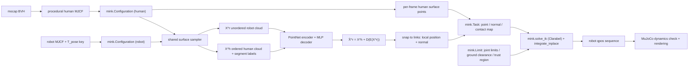

<h1 align="center">UMR</h1> 

<p align="center">
  <b>Unified Motion Retargeting for Humanoids with Learned Point Cloud Correspondence</b><br>
  Surface-point-cloud retargeting from mocap to humanoid robots — no hand-authored joint mapping.
</p>

<p align="center">
  <a href="README.md"></a>
  <a href="README.zh-CN.md"></a>
</p>

<p align="center">
  <a href="LICENSE"></a>
  
  
  <a href="https://arxiv.org/abs/2609.02134"></a>
</p>

> **Unofficial.** An independent reproduction inspired by the original authors' paper
> ([arXiv:2609.02134](https://arxiv.org/abs/2609.02134)). This is not the official implementation
> and is not affiliated with or endorsed by the authors.

UMR retargets a mocap clip onto a humanoid robot by matching **outer surface point clouds**
instead of skeletons, so switching robots needs no new human↔robot joint correspondence.
This repository implements both stages on top of **MuJoCo + [mink](https://github.com/kevinzakka/mink)**:
the point / normal / contact residuals are `mink.Task` subclasses, ground clearance and the trust
region are `mink.Limit` subclasses, and the QP goes to **Clarabel** via `qpsolvers`.

**Unitree G1** (29 DoF) ships with the repo and runs out of the box.


*Stage II retargeting, mid-stride. Red dots are the selected human surface points, green dots are
their learned counterparts on the robot — same index, same body part, none of it assigned by hand.*

---

## Repository layout

```
umr/
├── environment.yml                     # the only dependency list
├── configs/g1_29dof_rev_1_0.yaml       # every hyperparameter, plus the robot block
├── assets/robots/g1_description/       # MJCF + STL meshes, one dir per robot
├── data/walk_slow.bvh                  # source clip
├── scripts/retarget.py                 # entry point 1: all three stages + live player
├── scripts/report.py                   # entry point 2: dynamics check + metric report
├── umr/
│   ├── stages.py     # stage orchestration and fingerprint caching
│   ├── cli.py, config.py, paths.py     # argument parsing, config loading, artifact layout
│   ├── bootstrap.py  # drops user site-packages, picks the MuJoCo render backend
│   ├── bodies/       # BVH parsing, skeletons, human MJCF generation, robot wrapper, sampler
│   ├── correspondence/  # Stage I: network, losses, geodesic graph, training, evaluation
│   ├── tasks/        # mink.Task subclasses      (Eq. 7, 8)
│   ├── limits/       # mink.Limit subclasses     (Eq. 13, 14)
│   ├── retarget/     # link binding, per-frame pipeline, pkl export
│   ├── sim/          # dynamics validation, offline rendering, interactive players
│   └── report.py, metrics.py           # metrics rolled up into report.md / metrics.npz
└── output/<human>_to_<robot>/          # generated motions, videos, reports
```

## Method



**Stage I — correspondence learning (paper III-B).** Trained once on the aligned canonical T-pose,
producing a reusable ordered set of human↔robot surface point pairs:

$$\hat{X}^r = X^h + D_\theta(E_\theta(X^r))$$

$E_\theta$ is a PointNet-style encoder that compresses the *unordered* robot cloud into a latent
vector; $D_\theta$ is a per-point MLP predicting a deformation for each *ordered* human template
point. The loss $L_{corr} = \lambda_c L_c + \lambda_r L_r + \lambda_e L_e$ combines symmetric
Chamfer, KNN repulsion, and edge smoothing on the human geodesic graph (Eq. 2–5). Because the
indexing is inherited from the human cloud, robot points inherit human segment labels
automatically — this is where "no manual body mapping" comes from.

**Stage II — correspondence-guided retargeting (paper III-C).** Eq. (6) is solved per frame:
position and normal residuals (Eq. 7) plus a contact-map residual (Eq. 8–11), under joint limits,
ground clearance (Eq. 14) and a trust region, via damped Gauss-Newton (Eq. 12–13). The previous
frame warm-starts the next one.

The optimisation maps onto mink one-to-one, which is why there is no hand-written Gauss-Newton
loop here: `mink.build_ik` already assembles `min ½Δqᵀ(μI + ΣJᵀWJ)Δq + cᵀΔq s.t. GΔq ≤ h`, so each
residual only has to be a `Task` and each constraint a `Limit`. The one thing that does need care
is the Jacobian: `Configuration.get_frame_jacobian` is called **once per body**, never per point,
and every point on that body is derived from rigid-body kinematics,

$$J_{point} = jac_p - [\Delta]_\times jac_r,\qquad J_{normal} = -[n_w]_\times jac_r$$

so an iteration costs O(nbody) ≈ 25 Jacobian calls instead of O(npoints) = 512.

## Citation

```bibtex
@article{cao2026umr,
  title   = {Unified Motion Retargeting for Humanoids with Learned Point Cloud Correspondence},
  author  = {Cao, Hanyang and Fang, Yuetong and Kwon, Taesoo and Yu, Runyi and Ma, Ji and
             Tan, Jing and Zhou, Yangchen and Du, Baoze and Gu, Yi and Gao, Yukang and
             Dai, Ruoli and Han, Lei and Xu, Renjing},
  journal = {arXiv preprint arXiv:2609.02134},
  year    = {2026}
}
```

## Installation

```bash
conda env create -f environment.yml
conda activate umr
```

Python 3.10, mujoco 3.9.0, mink 1.1.1, clarabel 0.11.1, torch 2.12.0. Verify:

```bash
python -c "import qpsolvers; assert 'clarabel' in qpsolvers.available_solvers; print('ok')"
```

A GPU is optional and only used by Stage I training (~23 s on an RTX 3090, ~11 min on 28 CPU
cores). `correspondence.device: auto` falls back to CPU on its own. No system CUDA Toolkit is
needed — the pip torch wheel bundles its own runtime and only wants an NVIDIA driver.

If numpy or mujoco is also installed under `~/.local/lib/python3.10/site-packages`, it shadows the
conda env. `environment.yml` sets `PYTHONNOUSERSITE=1`, and both entry scripts additionally call
`umr/bootstrap.py` to drop user site from `sys.path` before importing anything, since that
variable is only read at interpreter start-up.

## Quick start

Robot models and the source clip ship with the repo, so this runs as-is:

```bash
python scripts/retarget.py --motion_file data/walk_slow.bvh --tgt_fps 30
```

That runs Stage 0 (human + robot MuJoCo bodies, T-pose surface sampling), Stage I (correspondence
learning + link binding) and Stage II (per-frame retargeting), then opens the live player.
`scripts/report.py` reads those artifacts and writes the metric report:

```bash
python scripts/report.py --motion_file data/walk_slow.bvh --replay --corr_image --record_video
```

Both entry points share the same argument group:

| Flag | Effect |
|---|---|
| `--motion_file` | a BVH file, or a directory of them (searched recursively, structure preserved) |
| `--human` | source skeleton: `xsens` (default) or `fzmotion` |
| `--robot` | registered name (`unitree_g1`, `g1`) or a path to a config yaml |
| `--tgt_fps` | output frame rate; defaults to the source rate, which is read from the BVH `Frame Time` header |
| `--save_path` | artifact root, default `output/` |

Batch processing a whole shoot, with video export, on multiple processes:

```bash
python scripts/retarget.py --motion_file data/my_session --tgt_fps 30 \
    --record_video --multi_process --override
```

Other flags worth knowing:

| Flag | Effect |
|---|---|
| `retarget.py --start 5 --duration 10` | retarget seconds 5–15 only |
| `retarget.py --interpolation_method linear` | normalised lerp instead of slerp when resampling |
| `retarget.py --tpose_offset 0` | drop the T-pose shape compensation, i.e. Eq. (7) verbatim (see [Results](#results)) |
| `retarget.py --lock_ankle_roll` | freeze ankle roll at its value during the standing lead-in |
| `retarget.py --trust_region l2` | exact L2 trust region via Clarabel SOCP (default `box`) |
| `retarget.py --n_selected 1024` | larger selected set $\|I\|$ (slower) |
| `retarget.py --solver proxqp` | switch QP backend |
| `retarget.py --device cpu` | force CPU for Stage I |
| `retarget.py --share_setup file` | one Stage 0/I setup per file instead of per directory |
| `report.py --replay` | additionally run the open-loop PD replay |
| `report.py --replay_viewer` | play the PD replay next to the kinematic reference in a window (implies `--replay`) |

All hyperparameters live in the config file.

### Artifact layout and caching

```
output/
├── xsens_to_unitree_g1/
│   ├── walk_slow.pkl                 # main product, GMR-compatible fields
│   ├── walk_slow.mp4                 # --record_video
│   └── walk_slow/
│       ├── motion.npz                # Stage II result
│       └── report.md / metrics.npz   # written by report.py
└── .setup/xsens_to_unitree_g1/<skeleton signature>/
    ├── human.xml                     # generated human MJCF
    ├── bodies.npz                    # Stage 0: T-pose surface clouds
    ├── correspondence.npz            # Stage I: learned correspondence
    └── correspondence.png            # report.py --corr_image
```

**Stage 0 and I are shared across clips.** They depend only on the robot, the source skeleton and
the actor's bone lengths — not on which motion was performed. That is exactly the "reusable point
cloud correspondence setup" of paper Table I, so they are addressed by a skeleton signature under
`.setup/`. Batch-processing dozens of takes from one shoot trains the correspondence once.
`--share_setup file` switches to one setup per file, for directories that mix actors of clearly
different builds.

**Every stage is fingerprinted.** Each npz carries a hash of its inputs and the relevant config
sections, chained downstream, so changing `--duration` only re-runs Stage II while changing the
sample count goes back to Stage 0. `--override` means "don't skip this clip"; `--force` also
invalidates the stage caches.

### Interactive player

`scripts/retarget.py` opens a live MuJoCo window when it finishes, starting paused on frame 0
(pointing it at an already-computed clip skips straight to the window). **Hold →** to play,
**hold ←** to rewind, release to pause. Space toggles autoplay, `.` / `,` single-step,
`[` / `]` change speed, `T` toggles camera follow, `P` toggles correspondence points, `Esc` quits.
`--human_offset 0` overlays the human and robot instead of placing them side by side;
`--robot_only` hides the human; `--no_viewer` skips the window entirely.

`report.py --replay_viewer` opens the same player on the PD replay instead: the robot standing in
place is the kinematic reference, the one offset along +Y is what the simulation actually tracked.
`--replay_offset 0` overlays them.

> Neither player uses `mujoco.viewer.launch_passive`: its `key_callback` only fires on key-down,
> so "release to pause" is impossible. Both build a GLFW window directly and read raw
> `PRESS` / `REPEAT` / `RELEASE` events — see [`umr/sim/interactive.py`](umr/sim/interactive.py).

### Adding a robot

Drop in the MJCF and meshes, copy `configs/g1_29dof_rev_1_0.yaml`, and register one line in
`ROBOT_CONFIGS` in [`umr/config.py`](umr/config.py). Nothing else changes — only the `robot` block
of the config differs between robots, and no hyperparameter is retuned. The morphology keys are
read by [`RobotSpec`](umr/bodies/robot.py):

| Key | Meaning |
|---|---|
| `tpose_joints` | joint angles for the canonical T-pose; everything else is 0 and the base height is solved so the soles touch the floor |
| `marker_body_prefixes` / `_suffixes` | bodies whose geoms are markers, not outer surface |
| `foot_bodies` | the ankle links used to measure foot height |
| `foot_name_keys` | substrings identifying foot bodies when locating sole geometry |

The model itself only has to satisfy four things: it loads with
`mujoco.MjModel.from_xml_path`, its root is a `<freejoint/>`, its hinge joints carry `range`
limits (`mink.ConfigurationLimit` needs them for Eq. 13), and its soles are findable via
`foot_name_keys` (for the Eq. 14 clearance constraint).

**`tpose_joints` is the one that bites.** Do not assume zero means straight. On G1 the elbow is
perpendicular to the upper arm at angle 0, so setting only the two shoulder rolls yields a fake
T-pose leaning 45.9° forward with just 0.278 m from shoulder to wrist; the elbows need +90° to
actually straighten (0.9°, 0.368 m). Stage 0 and I build the correspondence in exactly this pose,
and getting it wrong skews everything downstream without raising a single error.

A new mocap naming convention means adding one `Skeleton` to
[`umr/bodies/skeletons.py`](umr/bodies/skeletons.py); as long as it emits the same 21 segment
labels, everything downstream is unchanged.

> The first run **modifies the MJCF in place**: it injects a `T_pose` keyframe and enlarges the
> offscreen framebuffer to 1920x1080. This is idempotent.
>
> G1's official MJCF was also patched here in two ways that affect dynamics only, never
> retargeting (all three stages are purely kinematic): `armature="0.01"` on the 29 hinge joints
> (the value MuJoCo Menagerie uses for `unitree_g1`; the official file sets none, leaving the
> wrist DoFs at 3.7e-4 joint-space inertia, where gravity alone is 127 rad/s²), and `timestep`
> from 2 ms to 1 ms. Without them the explicit PD replay in `report.py --replay` diverges to NaN
> within a few steps.

## Results

Unitree G1 (29 DoF, 1.32 m), full 71.2 s clip (240 Hz → 30 Hz, 2138 frames), RTX 3090 + i7.

| Stage I | |
|---|---|
| Chamfer recon→target | 17.6 mm |
| 2 cm coverage | 70.4 % |
| **Anatomical consistency** | **92.3 %** |

| Stage II | |
|---|---|
| Point error, median | **15.6 mm** |
| Normal error, mean | 7.1° |
| Peak joint torque, median | 5.9 N·m |
| Foot penetration, max | 0.00 mm |
| Joint limit violations | 0 % |
| QP failures | 0 |

| Cost | |
|---|---|
| Setup (sampling + training + binding) | 41.5 s, once per robot and actor |
| Retargeting throughput | **43.8 FPS** |

Anatomical consistency measures whether learned correspondences land on the anatomically right
limb, with **no manual skeleton mapping** anywhere in the pipeline. Per-segment breakdowns are
printed by Stage I; the remaining gap is dominated by the head and clavicles, which G1's 29 DoF
MJCF folds into `torso_link` and which therefore have no link name to match against. The paper
reports 65.29 FPS overall throughput; self-collision avoidance costs roughly 25% of ours and is on
by default for G1 (see below).

**The point error is not the metric to minimise.** Eq. (7) asks the robot's surface points to
reach the human's, but the two bodies still differ by ~56 mm in T-pose after height normalisation
and no joint angle removes that. `tpose_offset` folds that constant into the target, and the two
settings trade off against each other:

| Config | Point error, median | Normal error, mean | Foot tracking corr L / R | Contact ratio | Airborne frames |
|---|---|---|---|---|---|
| **default** (`tpose_offset 1`) | **15.6 mm** | **7.1°** | 0.47 / 0.07 | 60 % | 47 % |
| `--tpose_offset 0` | 33.4 mm | 42.1° | **0.67 / 0.64** | **75 %** | **38 %** |

Both keep foot penetration at 0.00 mm, joint limit violations at 0 % and QP failures at 0. G1
ships with `tpose_offset: 1.0` because the offset is close to uniform across segments once Stage 0
has normalised the actor to robot height (hand 62 mm, forearm 57 mm, torso 53 mm, foot 51 mm), so
subtracting it recovers the pose the actor was actually in. The cost is that Eq. (7) no longer
pins the robot's foot to where the human's foot literally was, and per-foot ground contact
degrades. Judge retargeting quality by per-foot height tracking, penetration and contact ratio —
and by whether the joint angles are sane — rather than by Eq. (7)'s residual alone.

**Self-collision avoidance is on for G1.** Its wrists sit exactly at hip height, so in walking
clips with the arms hanging naturally the wrist cuts into the hip link: 698 of the first 960
frames self-collide, up to 23.0 mm deep. `retarget.self_collision: true` brings that down to
3.0 mm at no cost in point error and zero QP failures, for about 25% throughput. Clips where the
limbs never approach the torso activate no constraints and pay nothing.

Full report: `output/xsens_to_unitree_g1/walk_slow/report.md`.
Comparison video: `output/xsens_to_unitree_g1/walk_slow.mp4`.

## Output format

Stage II writes `motion.npz` (used by the player and `report.py`) and a `.pkl` whose fields match
GMR so downstream tooling works unchanged:

```python
{
  "root_trans":  (T, 3),   # base translation
  "root_rot":    (T, 4),   # base rotation, xyzw (downstream convention)
  "dof":         (T, 29),  # joint angles
  "dof_full":    (T, 29),
  "qpos":        (T, 36),  # raw MuJoCo layout, quaternion is wxyz
  "fps": 30.0, "dof_names": [...], "body_names": [...],
  "quality_metrics": {...}, "point_error": (T,), "normal_error": (T,),
  "contact_count": (T,), "frame_indices": (T,),
  "source_file": ..., "robot_xml": ..., "scale": ..., "ground_offset": ...,
}
```

Note `root_rot` is **xyzw** while `qpos` keeps MuJoCo's **wxyz**.

## Differences from the paper

- **Source mesh** is a rigid-body human generated procedurally from the BVH skeleton, not SMPL-X
  with shape fitting. Its surface is piecewise-smooth convex primitives, so normals carry a
  systematic bias against the robot's faceted CAD meshes. Paper III-A lists rigged humanoid
  characters as a valid source.
- **Trust region** defaults to the inscribed box of the L2 ball
  ($\|\Delta q\|_\infty \le \eta/\sqrt{n_v}$), which satisfies the L2 constraint with any QP
  backend. `--trust_region l2` uses the Clarabel SOCP branch and matches Eq. (13) exactly.
- **Ground contact and self-collision only** — no object or scene interaction, since the bundled
  clip is walking. `ContactMapTask` is written against a general environment point cloud, so
  adding objects means replacing `environment`.
- **No downstream RL.** There is no BeyondMimic / SONIC / OmniRetarget comparison and no LAFAN1
  benchmark. The PD replay in `report.py --replay` is an **open-loop underactuated** simulation
  with no balance controller — a kinematic reference is expected to fall, and this one survives
  3.9 s at 0.007 rad of joint tracking error before it does. It is a reproducible feasibility
  probe, not a stability claim; `--replay_viewer` shows the difference between "the joints track
  fine" and "the robot stays up" directly.
- **ZMP** uses the standard CoM approximation that ignores angular momentum rate. Walking is
  controlled falling, so single-support ZMP excursions past the foot edge are normal.

## License

Code is released under the [MIT License](LICENSE).

Robot assets keep their own terms: the Unitree G1 description is BSD-3-Clause
(see [`assets/robots/g1_description/LICENSE`](assets/robots/g1_description/LICENSE)) and is
vendored from [unitree_ros](https://github.com/unitreerobotics/unitree_ros).
