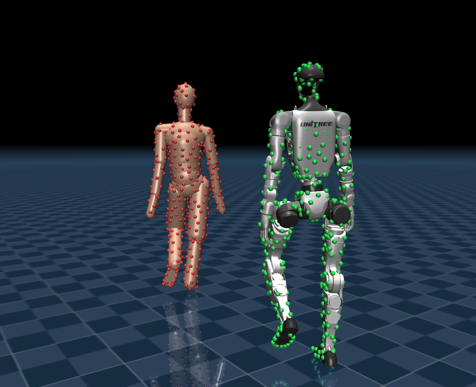
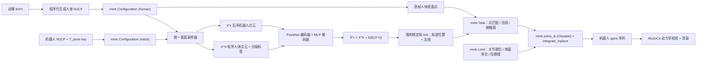

<h1 align="center">UMR</h1>

<p align="center">
  <b>Unified Motion Retargeting for Humanoids with Learned Point Cloud Correspondence</b><br>
  基于外表面点云的动捕重定向 —— 不需要人工指定关节映射。
</p>

<p align="center">
  <a href="README.md"></a>
  <a href="README.zh-CN.md"></a>
</p>

<p align="center">
  <a href="LICENSE"></a>
  
  
  <a href="https://arxiv.org/abs/2609.02134"></a>
</p>

> **非官方实现。** 本项目是受原作者论文（[arXiv:2609.02134](https://arxiv.org/abs/2609.02134)）
> 启发的独立复现，不是官方实现，与原作者无隶属关系，也未经原作者背书。

UMR 用**外表面点云**而不是骨架来做重定向，因此换机器人不需要重新定义人机关节对应。
本仓库把两个阶段都搭在 **MuJoCo + [mink](https://github.com/kevinzakka/mink)** 上：
点/法线/接触残差是 `mink.Task` 子类，地面净空与信赖域是 `mink.Limit` 子类，
QP 经 `qpsolvers` 交给 **Clarabel** 求解。

仓库自带 **Unitree G1**（29 自由度），克隆下来即可跑通。



*Stage II 重定向的一帧。红点是选中的人体表面点，绿点是它们在机器人上学到的对应点——
下标相同、部位相同，机器人一侧没有任何人工指定的部分。*

---

## 目录结构

```
umr/
├── environment.yml                     # 唯一的依赖清单
├── configs/g1_29dof_rev_1_0.yaml       # 全部超参，外加 robot 段
├── assets/robots/g1_description/       # 每台机器人一个目录：MJCF + STL 网格
├── data/walk_slow.bvh                  # 源动作
├── scripts/retarget.py                 # 入口一：三个阶段 + 实时播放器
├── scripts/report.py                   # 入口二：动力学校验 + 指标报告
├── umr/
│   ├── stages.py     # 三个阶段的编排与指纹缓存
│   ├── cli.py, config.py, paths.py     # 入参解析、配置加载、产物布局
│   ├── bootstrap.py  # 屏蔽 user site、设定 MuJoCo 渲染后端
│   ├── bodies/       # BVH 解析、源骨架定义、人体 MJCF 生成、机器人封装、表面采样器
│   ├── correspondence/  # Stage I：网络 / 损失 / 测地图 / 训练 / 评估
│   ├── tasks/        # mink.Task 子类   （式 7、8）
│   ├── limits/       # mink.Limit 子类  （式 13、14）
│   ├── retarget/     # link 绑定、逐帧流水线、pkl 导出
│   ├── sim/          # 动力学校验、离线渲染、实时播放器
│   └── report.py, metrics.py           # 校验结果汇总成 report.md / metrics.npz
└── output/<源骨架>_to_<机器人>/         # 生成的动作、视频与报告
```

## 方法



**Stage I —— 点云对应学习（论文 III-B）。** 在对齐的 canonical T-pose 上只学一次，
得到一组**可复用**的有序人机表面点对：

$$\hat{X}^r = X^h + D_\theta(E_\theta(X^r))$$

$E_\theta$ 是 PointNet 风格的编码器，把**无序**的机器人点云压成全局隐向量；
$D_\theta$ 是逐点 MLP，为每个**有序**的人体模板点预测一个形变向量。
损失 $L_{corr} = \lambda_c L_c + \lambda_r L_r + \lambda_e L_e$ 分别是对称 Chamfer、
KNN 排斥、以及人体测地图上的边平滑（式 2–5）。因为下标继承自人体点云，
机器人点自动继承人体分段标签——这正是"不需要人工身体映射"的来源。

**Stage II —— 对应引导的重定向（论文 III-C）。** 逐帧求解式 (6)：位置与法线残差（式 7）
加接触图残差（式 8–11），在关节限位、地面净空（式 14）和信赖域约束下做阻尼
Gauss-Newton 迭代（式 12–13）。上一帧的解作为下一帧的初值。

这里没有手写 Gauss-Newton 循环，因为 UMR 的优化问题与 mink 的 QP 本就是同一个形式：
`mink.build_ik` 已经把 `min ½Δqᵀ(μI + ΣJᵀWJ)Δq + cᵀΔq s.t. GΔq ≤ h` 装配好了，
每个残差只需写成一个 `Task`，每个约束写成一个 `Limit`。真正要留神的是 Jacobian ——
`Configuration.get_frame_jacobian` **每个 body 只调一次**，绝不逐点调用，同一 body
上所有点都由刚体运动学推出：

$$J_{point} = jac_p - [\Delta]_\times jac_r,\qquad J_{normal} = -[n_w]_\times jac_r$$

于是每次迭代的 Jacobian 调用是 O(nbody)≈25 次，而不是 O(npoints)=512 次。

## 引用

```bibtex
@article{cao2026umr,
  title   = {Unified Motion Retargeting for Humanoids with Learned Point Cloud Correspondence},
  author  = {Cao, Hanyang and Fang, Yuetong and Kwon, Taesoo and Yu, Runyi and Ma, Ji and
             Tan, Jing and Zhou, Yangchen and Du, Baoze and Gu, Yi and Gao, Yukang and
             Dai, Ruoli and Han, Lei and Xu, Renjing},
  journal = {arXiv preprint arXiv:2609.02134},
  year    = {2026}
}
```

## 安装

```bash
conda env create -f environment.yml
conda activate umr
```

Python 3.10，mujoco 3.9.0、mink 1.1.1、clarabel 0.11.1、torch 2.12.0。自检：

```bash
python -c "import qpsolvers; assert 'clarabel' in qpsolvers.available_solvers; print('ok')"
```

GPU 可选，只有 Stage I 训练用得到（RTX 3090 约 23 s，28 核 CPU 约 11 min）。
`correspondence.device: auto` 在没有 GPU 时会自动退回 CPU。不需要装系统 CUDA Toolkit ——
pip 的 torch 轮子自带运行时，有 NVIDIA 驱动即可。

如果 `~/.local/lib/python3.10/site-packages` 下也装过 numpy 或 mujoco，它们会遮蔽 conda
环境。`environment.yml` 里设了 `PYTHONNOUSERSITE=1`，两个入口脚本还会在导入任何第三方包
之前调用 `umr/bootstrap.py` 把 user site 从 `sys.path` 里摘掉——该环境变量只在解释器启动时
被读取，在脚本里再设已经太晚。

## 快速开始

机器人模型和源动作都随仓库提供，克隆下来即可运行：

```bash
python scripts/retarget.py --motion_file data/walk_slow.bvh --tgt_fps 30
```

这会依次跑 Stage 0（人机 MuJoCo 身体 + T-pose 表面采样）、Stage I（对应学习 + link 绑定）、
Stage II（逐帧重定向），最后打开实时播放器。`scripts/report.py` 读它的产物做校验并写报告：

```bash
python scripts/report.py --motion_file data/walk_slow.bvh --replay --corr_image --record_video
```

两个入口共用同一组入参：

| 入参 | 说明 |
|---|---|
| `--motion_file` | BVH 文件，或装着一堆 BVH 的目录（递归查找，保留相对目录结构） |
| `--human` | 源动捕骨架：`xsens`（默认）或 `fzmotion` |
| `--robot` | 已登记的型号（`unitree_g1`、`g1`）或一个配置 yaml 的路径 |
| `--tgt_fps` | 输出帧率，默认与源一致；**源帧率从 BVH 头部的 `Frame Time` 自动读取** |
| `--save_path` | 输出根目录，默认 `output/` |

批量处理一整场采集，顺便导出视频、多进程无窗口：

```bash
python scripts/retarget.py --motion_file data/my_session --tgt_fps 30 \
    --record_video --multi_process --override
```

其余常用参数：

| 参数 | 作用 |
|---|---|
| `retarget.py --start 5 --duration 10` | 只截取第 5–15 秒 |
| `retarget.py --interpolation_method linear` | 重采样时旋转改用归一化 lerp（默认 `slerp`） |
| `retarget.py --tpose_offset 0` | 关掉 T-pose 形状偏置补偿，即式 (7) 原式（见[结果](#结果)） |
| `retarget.py --lock_ankle_roll` | 把踝 roll 锁到片头静止段的取值 |
| `retarget.py --trust_region l2` | 用 Clarabel SOCP 解严格 L2 信赖域（默认 `box`） |
| `retarget.py --n_selected 1024` | 增大选中集 $\|I\|$（更慢） |
| `retarget.py --solver proxqp` | 换 QP 后端 |
| `retarget.py --device cpu` | Stage I 强制走 CPU |
| `retarget.py --share_setup file` | Stage 0/I 改成逐文件一套，而不是逐目录一套 |
| `report.py --replay` | 额外做 PD 开环回放仿真 |
| `report.py --replay_viewer` | 开窗把 PD 回放与运动学参考并排播出来（隐含 `--replay`） |

全部超参集中在配置文件里。

### 产物布局与缓存

```
output/
├── xsens_to_unitree_g1/
│   ├── walk_slow.pkl                 # 主产物，与 GMR 字段兼容
│   ├── walk_slow.mp4                 # --record_video
│   └── walk_slow/
│       ├── motion.npz                # Stage II 结果
│       └── report.md / metrics.npz   # report.py 产出
└── .setup/xsens_to_unitree_g1/<骨架签名>/
    ├── human.xml                     # 生成的人体 MJCF
    ├── bodies.npz                    # Stage 0：T-pose 表面点云
    ├── correspondence.npz            # Stage I：学到的点云对应
    └── correspondence.png            # report.py --corr_image
```

**Stage 0/I 跨片段共享。** 这两步只取决于「机器人 + 源骨架 + 演员骨架尺寸」，与具体
是哪一段动作无关（正是论文 Table I 说的可复用对应设置），所以按骨架签名寻址放在
`.setup/` 下。批量处理同一场采集的几十段导出时，对应学习只跑一次。目录里混了体型
差异明显的多个演员时，用 `--share_setup file` 改成逐文件一套。

**阶段缓存。** 每个阶段的 npz 里都存了一枚指纹（输入内容 + 相关配置段），指纹不变
就直接复用，并链式传给下游。所以改 `--duration` 只会重算 Stage II，改采样点数才会
从 Stage 0 重来。`--override` 只是「别跳过这个文件」，`--force` 才会连阶段缓存一起作废。

### 实时播放器

`scripts/retarget.py` 跑完会打开一个实时 MuJoCo 窗口，起始停在第 0 帧（结果已经算好时
再指到同一个文件，会跳过求解直接开窗）。**按住 →** 播放，**按住 ←** 回退，松手暂停。
空格切换自动播放，`.` / `,` 单步，`[` / `]` 调速，`T` 切换相机跟随，`P` 切换对应点显示，
`Esc` 退出。`--human_offset 0` 让人机重叠显示（直接看贴合程度），`--robot_only` 只显示
机器人，`--no_viewer` 只算不看。

`report.py --replay_viewer` 用同一个播放器看 PD 回放：原地那台是运动学参考，沿 +Y 偏开的
那台是仿真里真跟出来的姿态，`--replay_offset 0` 可让两者重叠。

> 两个播放器都没用 `mujoco.viewer.launch_passive`：它的 `key_callback` 只在按下时触发，
> 做不了"松手暂停"。这里直接建 GLFW 窗口收原始的 `PRESS`/`REPEAT`/`RELEASE` 事件，
> 实现见 [`umr/sim/interactive.py`](umr/sim/interactive.py)。

### 换一台机器人

放好 MJCF 与网格，照着 `configs/g1_29dof_rev_1_0.yaml` 复制一份配置，再到
[`umr/config.py`](umr/config.py) 的 `ROBOT_CONFIGS` 里补一行，就没有别的代码要改了——
机器人之间只有配置的 `robot` 段不同，方法本身的超参一个都不用重调。形态相关的键由
[`RobotSpec`](umr/bodies/robot.py) 读走：

| 键 | 作用 |
|---|---|
| `tpose_joints` | canonical T-pose 的关节角，其余取 0，基座高度由脚底贴地自动求出 |
| `marker_body_prefixes` / `_suffixes` | 这些 body 上的 geom 只是标记点，不算外表面 |
| `foot_bodies` | 量足部高度用的踝 link |
| `foot_name_keys` | 找足底几何时匹配的 body 名关键字 |

对模型本身的要求只有四条：能被 `mujoco.MjModel.from_xml_path` 加载、根节点是
`<freejoint/>`、各转动关节带 `range` 限位（`mink.ConfigurationLimit` 靠它生成式 (13) 的
约束）、足底几何能按 `foot_name_keys` 找到（用于式 (14) 的净空约束）。

**最容易踩的是 `tpose_joints`：别假设「零位就是伸直」。** G1 的肘角为 0 时前臂垂直于
上臂，只设两个肩 roll 会得到一个前倾 45.9°、肩到腕仅 0.278 m 的假 T-pose；肘角取 +90°
才真正伸直（0.9°、0.368 m）。Stage 0/I 正是在这个姿态上建立人机对应，摆错了后面全歪，
而且全程不报错。

换一套动捕命名约定则是在 [`umr/bodies/skeletons.py`](umr/bodies/skeletons.py) 里补一个
`Skeleton`；只要它产出的仍是那 21 个分段标签，下游全部不用改。

> 首次运行会**就地修改** MJCF：注入一个 `T_pose` keyframe 并把离屏帧缓冲放大到
> 1920x1080。这是幂等的。
>
> G1 的官方 MJCF 另外补过两处，都只影响动力学、不影响重定向（三个阶段是纯运动学的）：
> 29 个转动关节加 `armature="0.01"`（取值同 MuJoCo Menagerie 的 `unitree_g1`；官方文件
> 一个都没写，腕部自由度的关节空间惯量只有 3.7e-4，光重力就有 127 rad/s²），以及把
> `timestep` 从 2 ms 改成 1 ms。不补的话 `report.py --replay` 的显式 PD 回放会在头几步
> 就发散成 NaN。

## 结果

Unitree G1（29 DoF，1.32 m），完整片段 71.2 秒（240 Hz → 30 Hz，2138 帧），RTX 3090 + i7。

| Stage I | |
|---|---|
| Chamfer recon→target | 17.6 mm |
| 2 cm 覆盖率 | 70.4 % |
| **解剖学一致性** | **92.3 %** |

| Stage II | |
|---|---|
| 点匹配误差中位数 | **15.6 mm** |
| 法线误差均值 | 7.1° |
| 最大关节力矩中位数 | 5.9 N·m |
| 足部穿透最大值 | 0.00 mm |
| 关节限位违反 | 0 % |
| QP 求解失败 | 0 |

| 开销 | |
|---|---|
| 准备阶段（采样 + 训练 + 绑定） | 41.5 s，每台机器人 + 每个演员只需一次 |
| 重定向吞吐 | **43.8 FPS** |

解剖学一致性衡量学到的对应是否落在解剖学正确的肢体上，全流程**没有任何人工骨骼映射**。
逐分段结果由 Stage I 直接打印；差掉的部分主要来自头部与锁骨——G1 的 29 DoF MJCF 把它们
并进了 `torso_link`，没有可供匹配的连杆名。论文报告的整体吞吐为 65.29 FPS；这里的自碰撞
约束占掉约 25%，G1 上默认开启（见下）。

**点误差不是那个该被最小化的量。** 式 (7) 字面上要求机器人的表面点落到人体的表面点上，
可两具身体在按身高归一化之后、T-pose 下仍差着约 56 mm，这部分残差再怎么解也消不掉。
`tpose_offset` 就是用来折掉这个常量的，两种取值各有得失：

| 配置 | 点误差中位数 | 法线误差均值 | 足部跟踪 corr 左 / 右 | 接触比例 | 腾空帧 |
|---|---|---|---|---|---|
| **默认**（`tpose_offset 1`） | **15.6 mm** | **7.1°** | 0.47 / 0.07 | 60 % | 47 % |
| `--tpose_offset 0` | 33.4 mm | 42.1° | **0.67 / 0.64** | **75 %** | **38 %** |

两者的足部穿透都是 0.00 mm，关节限位违反 0%，QP 失败 0 次。G1 默认取
`tpose_offset: 1.0`，是因为 Stage 0 已经把演员按机器人身高归一化，偏置在各分段上相当均匀
（手 62 mm、前臂 57 mm、躯干 53 mm、脚 51 mm），减掉它得到的才是演员真正的姿态。代价是
式 (7) 不再把机器人的脚钉在人的脚所在位置上，逐脚地面接触随之变差。评价重定向质量应当看
逐脚离地高度跟踪、穿透与接触比例这类物理量，以及关节角本身是否合理，而不是只看式 (7)
的残差。

**G1 上自碰撞约束必须开。** 它的腕部正好落在髋侧，手臂自然下垂的行走片段里腕会切进髋
link——前 960 帧里有 698 帧自碰撞、最深穿透 23.0 mm。`retarget.self_collision: true`
把它降到 3.0 mm，点匹配误差不变、QP 零失败，代价是约 25% 的吞吐。四肢本来就不靠近躯干的
片段不会有约束被激活，开着也不亏。

完整报告见 `output/xsens_to_unitree_g1/walk_slow/report.md`，
对比视频见 `output/xsens_to_unitree_g1/walk_slow.mp4`。

## 输出格式

Stage II 写出 `motion.npz`（供播放器与 `report.py` 使用）和一份 `.pkl`，
后者字段与 GMR 一致，可直接喂给已有的下游工具：

```python
{
  "root_trans":  (T, 3),   # 基座平移
  "root_rot":    (T, 4),   # 基座旋转，xyzw（下游约定）
  "dof":         (T, 29),  # 关节角
  "dof_full":    (T, 29),
  "qpos":        (T, 36),  # MuJoCo 原始布局，四元数为 wxyz
  "fps": 30.0, "dof_names": [...], "body_names": [...],
  "quality_metrics": {...}, "point_error": (T,), "normal_error": (T,),
  "contact_count": (T,), "frame_indices": (T,),
  "source_file": ..., "robot_xml": ..., "scale": ..., "ground_offset": ...,
}
```

注意 `root_rot` 是 **xyzw**，而 `qpos` 保持 MuJoCo 的 **wxyz**。

## 与论文的差异

- **源端网格**是按 BVH 骨架程序化生成的刚体人体，不是 SMPL-X，也不做 shape 拟合。
  它的表面是分段光滑的凸基元，与机器人棱角分明的 CAD 网格之间存在系统性的法线偏置。
  论文 III-A 明确把 rigged humanoid characters 列为合法源。
- **信赖域**默认用 L2 球的内接盒（$\|\Delta q\|_\infty \le \eta/\sqrt{n_v}$），
  它满足 L2 约束且兼容任意 QP 后端；`--trust_region l2` 走 Clarabel SOCP 分支，与式 (13) 完全一致。
- **只有地面接触与自碰撞**，没有物体或场景交互（自带片段是行走）。`ContactMapTask` 按一般
  环境点云实现，接入物体只需替换 `environment`。
- **不含下游 RL**：没有 BeyondMimic / SONIC / OmniRetarget 对比，也没有 LAFAN1 基准。
  `report.py --replay` 的 PD 回放是**开环欠驱动**仿真，没有平衡控制器，运动学参考在这种条件下
  跌倒是预期行为——本片段在跌倒前撑了 3.9 s，关节跟踪误差 0.007 rad。它是可复现的可行性探针，
  不是稳定性结论；`--replay_viewer` 能直接看出"关节跟得住、整体站不住"这个区别。
- **ZMP** 用忽略角动量变化率的标准质心近似。行走本质上是受控失衡，单支撑相 ZMP 越过脚缘属正常现象。

## 许可

代码以 [MIT License](LICENSE) 发布。

机器人资产保留各自的授权：Unitree G1 描述文件为 BSD-3-Clause
（见 [`assets/robots/g1_description/LICENSE`](assets/robots/g1_description/LICENSE)），
来自 [unitree_ros](https://github.com/unitreerobotics/unitree_ros)。
