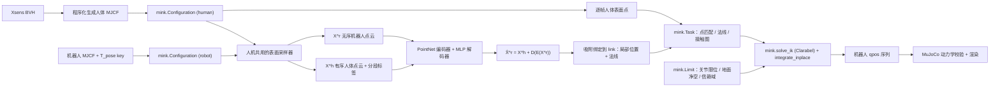

<h1 align="center">UMR</h1>

<p align="center">
  <b>Unified Motion Retargeting for Humanoids with Learned Point Cloud Correspondence</b><br>
  基于外表面点云的动捕重定向 —— 不需要人工指定关节映射。
</p>

<p align="center">
  <a href="README.md"></a>
  <a href="README.zh-CN.md"></a>
</p>

<p align="center">
  <a href="LICENSE"></a>
  
  
  <a href="https://arxiv.org/abs/2609.02134"></a>
</p>

> **非官方实现。** 本项目是受原作者论文（[arXiv:2609.02134](https://arxiv.org/abs/2609.02134)）
> 启发的独立复现，不是官方实现，与原作者无隶属关系，也未经原作者背书。

UMR 用**外表面点云**而不是骨架来做重定向，因此换机器人不需要重新定义人机关节对应。
本仓库把两个阶段都搭在 **MuJoCo + [mink](https://github.com/kevinzakka/mink)** 上：
点/法线/接触残差是 `mink.Task` 子类，地面净空与信赖域是 `mink.Limit` 子类，
QP 经 `qpsolvers` 交给 **Clarabel** 求解。

仓库自带 **Unitree G1**（29 自由度），克隆下来即可跑通。


*Stage II 重定向的一帧。红点是选中的人体表面点，绿点是它们在机器人上学到的对应点——
下标相同、部位相同，机器人一侧没有任何人工指定的部分。*

---

## 目录结构

```
umr/
├── environment.yml                     # 唯一的依赖清单
├── run_all.sh                          # 全流程脚本
├── configs/g1_29dof_rev_1_0.yaml       # Unitree G1（默认）
├── assets/robots/                      # 每台机器人一个目录：MJCF + STL 网格
├── data/                               # 源动作 BVH
├── scripts/01..05_*.py                 # 五个流程步骤
├── umr/
│   ├── bodies/       # BVH 解析、人体 MJCF 生成、机器人封装、表面采样器
│   ├── correspondence/  # Stage I：网络 / 损失 / 测地图 / 训练 / 评估
│   ├── tasks/        # mink.Task 子类   （式 7、8）
│   ├── limits/       # mink.Limit 子类  （式 13、14）
│   ├── retarget/     # link 绑定、逐帧流水线、pkl 导出
│   └── sim/          # 动力学校验、离线渲染、实时播放器
├── docs/TECHNICAL.md                   # 公式推导与实现细节
└── outputs/<config-name>/              # 生成的动作、视频与报告
```

## 方法



**Stage I — 点云对应学习（论文 III-B）。** 在对齐的 canonical T-pose 上学一次，
得到一组**可复用**的有序人机表面点对：

$$\hat{X}^r = X^h + D_\theta(E_\theta(X^r))$$

$E_\theta$ 是 PointNet 风格编码器，把**无序**的机器人点云压成全局隐向量；
$D_\theta$ 是逐点 MLP，为每个**有序**的人体模板点预测一个形变向量。
损失 $L_{corr} = \lambda_c L_c + \lambda_r L_r + \lambda_e L_e$ 由对称 Chamfer、
KNN 排斥、以及人体测地图上的边平滑组成（式 2–5）。因为下标继承自人体点云，
机器人点自动继承人体分段标签 —— 这就是"不需要人工身体映射"的来源。

**Stage II — 对应引导的重定向（论文 III-C）。** 逐帧求解式 (6)：位置与法线残差（式 7）
加接触图残差（式 8–11），在关节限位、地面净空（式 14）和信赖域约束下做阻尼
Gauss-Newton 迭代（式 12–13）。上一帧的解作为下一帧的初值。

## 引用

```bibtex
@article{cao2026umr,
  title   = {Unified Motion Retargeting for Humanoids with Learned Point Cloud Correspondence},
  author  = {Cao, Hanyang and Fang, Yuetong and Kwon, Taesoo and Yu, Runyi and Ma, Ji and
             Tan, Jing and Zhou, Yangchen and Du, Baoze and Gu, Yi and Gao, Yukang and
             Dai, Ruoli and Han, Lei and Xu, Renjing},
  journal = {arXiv preprint arXiv:2609.02134},
  year    = {2026}
}
```

## 安装

```bash
conda env create -f environment.yml
conda activate umr
```

Python 3.10，mujoco 3.9.0、mink 1.1.1、clarabel 0.11.1、torch 2.12.0。自检：

```bash
python -c "import qpsolvers; assert 'clarabel' in qpsolvers.available_solvers; print('ok')"
```

GPU 可选，只有 Stage I 训练用得到（RTX 3090 约 22 s，28 核 CPU 约 11 min）。
`correspondence.device: auto` 在没有 GPU 时会自动退回 CPU。

## 快速开始

机器人模型和源动作都随仓库提供，克隆下来即可运行：

```bash
./run_all.sh                    # Unitree G1，完整片段
./run_all.sh --duration 10      # 只跑前 10 秒
```

结果写到 `outputs/<config-name>/`。也可以分步执行：

```bash
python scripts/01_build_bodies.py           # 人机 MJCF + T-pose 表面采样
python scripts/02_learn_correspondence.py   # Stage I：对应学习 + link 绑定
python scripts/03_retarget.py               # Stage II：逐帧重定向
python scripts/04_visualize.py --mode corr  # 对应关系图
python scripts/04_visualize.py --mode video --points    # 人机并排视频
python scripts/04_visualize.py --mode viewer --points   # 实时播放器
python scripts/05_validate.py --replay      # 动力学校验 + 指标报告
```

所有脚本都接受 `--config`；用 `UMR_OUTPUT_DIR` 可以改产物目录。常用参数：

| 参数 | 作用 |
|---|---|
| `03_retarget.py --duration 10` | 只重定向前 10 秒 |
| `03_retarget.py --trust_region l2` | 用 Clarabel SOCP 解严格 L2 信赖域（默认 `box`） |
| `03_retarget.py --n_selected 1024` | 增大选中集 $\|I\|$（更慢，见 `docs/TECHNICAL.md` §8.3） |
| `03_retarget.py --solver proxqp` | 换 QP 后端 |
| `02_learn_correspondence.py --device cpu` | Stage I 强制走 CPU |

全部超参集中在配置文件里。

### 实时播放器

`--mode viewer` 打开一个实时 MuJoCo 窗口，起始停在第 0 帧。**按住 →** 播放，
**按住 ←** 回退，松手暂停。空格切换自动播放，`.` / `,` 单步，`[` / `]` 调速，
`T` 切换相机跟随，`P` 切换对应点显示，`Esc` 退出。
`--human_offset 0` 让人机重叠显示（直接看贴合程度），`--robot_only` 只显示机器人。

### 换机器人 / 换动作

见 [`assets/README.md`](assets/README.md) 与 [`data/README.md`](data/README.md)。
换机器人只改配置里的 `robot` 段，方法本身的超参不用重调。

## 结果

Unitree G1（29 DoF，1.32 m），完整片段 71.2 秒（240 Hz → 30 Hz，2137 帧），RTX 3090 + i7。

| Stage I | |
|---|---|
| Chamfer recon→target | 19.0 mm |
| 2 cm 覆盖率 | 67.7 % |
| **解剖学一致性** | **90.9 %** |

| Stage II | |
|---|---|
| 点匹配误差中位数 | **31.7 mm** |
| 法线误差均值 | 38.3° |
| 最大关节力矩中位数 | 5.8 N·m |
| 足部穿透最大值 | 0.57 mm |
| 逐脚离地高度跟踪 corr 左 / 右 | 0.80 / 0.59 |
| 关节限位违反 | 0 % |
| QP 求解失败 | 0 |

| 开销 | |
|---|---|
| 准备阶段（采样 + 训练 + 绑定） | 44.9 s，每台机器人只需一次 |
| 重定向吞吐 | **63.6 FPS** |

解剖学一致性衡量学到的对应是否落在解剖学正确的肢体上，全流程**没有任何人工骨骼映射**。
逐分段结果由 `02_learn_correspondence.py` 直接打印；差掉的 9 % 主要来自头部——
G1 的 29 DoF MJCF 把头并进了 `torso_link`，没有可供匹配的连杆名。
论文报告的整体吞吐为 65.29 FPS。

完整报告见 `outputs/<config-name>/report.md`，对比视频见 `outputs/<config-name>/retarget.mp4`。

## 输出格式

`03_retarget.py` 写出 `motion.npz`（供 04/05 使用）和 `motion.pkl`，
后者字段与 `agmr` / GMR 一致，可直接喂给已有的下游工具：

```python
{
  "root_trans":  (T, 3),   # 基座平移
  "root_rot":    (T, 4),   # 基座旋转，xyzw（下游约定）
  "dof":         (T, nj),  # 关节角
  "dof_full":    (T, nj),
  "qpos":        (T, nq),  # MuJoCo 原始布局，四元数为 wxyz
  "fps": 30.0, "dof_names": [...], "body_names": [...],
  "quality_metrics": {...}, "point_error": (T,), "normal_error": (T,),
  "contact_count": (T,), "frame_indices": (T,),
  "source_file": ..., "robot_xml": ..., "scale": ..., "ground_offset": ...,
}
```

注意 `root_rot` 是 **xyzw**，而 `qpos` 保持 MuJoCo 的 **wxyz**。

## 与论文的差异

- **源端网格**是按 BVH 骨架程序化生成的刚体人体，不是 SMPL-X，也不做 shape 拟合。
  它的表面是分段光滑的凸基元，与机器人棱角分明的 CAD 网格之间存在系统性的法线偏置；
  法线项权重较低，只作为软朝向线索。论文 III-A 明确把 rigged humanoid characters 列为合法源。
- **信赖域**默认用 L2 球的内接盒（$\|\Delta q\|_\infty \le \eta/\sqrt{n_v}$），
  它满足 L2 约束且兼容任意 QP 后端；`--trust_region l2` 走 Clarabel SOCP 分支，与式 (13) 完全一致。
- **只有地面接触**，没有物体、场景或自碰撞（自带片段是行走）。`ContactMapTask` 按一般环境点云
  实现，接入物体只需替换 `environment`。
- **不含下游 RL**：没有 BeyondMimic / SONIC / OmniRetarget 对比，也没有 LAFAN1 基准。
  `05_validate.py` 的 PD 回放是**开环欠驱动**仿真，没有平衡控制器，运动学参考在这种条件下
  跌倒是预期行为。它是可复现的可行性探针，不是稳定性结论。
- **ZMP** 用忽略角动量变化率的标准质心近似。行走本质上是受控失衡，单支撑相 ZMP 越过脚缘属正常现象。

## 许可

代码以 [MIT License](LICENSE) 发布。

机器人资产保留各自的授权：Unitree G1 描述文件为 BSD-3-Clause
（见 [`assets/robots/g1_description/LICENSE`](assets/robots/g1_description/LICENSE)），
来自 [unitree_ros](https://github.com/unitreerobotics/unitree_ros)。
