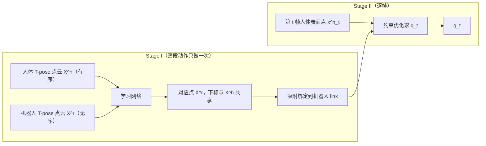

# UMR 技术详解：从一段 BVH 到一段机器人轨迹

> 配套论文：*Unified Motion Retargeting for Humanoids with Learned Point Cloud
> Correspondence*（arXiv:2609.02134v1）
> 配套代码：本仓库
>
> 这份文档面向想真正搞懂这套方法的读者。目标是：**读完之后，你能自己从零把它写一遍**。
> 因此所有公式都从头推导、不跳步骤，并且每个关键环节都说明工程上是用什么库、哪个接口、
> 为什么这么选。文中每个结论都标注了对应的源码位置。

---

## 目录

1. [问题定义](#1-问题定义)
2. [假设清单](#2-假设清单)
3. [记号约定](#3-记号约定)
4. [第一步：把两具身体放进同一套运动学框架](#4-第一步把两具身体放进同一套运动学框架)
5. [Stage I：点云对应学习](#5-stage-i点云对应学习)
6. [Stage II：对应引导的重定向](#6-stage-ii对应引导的重定向)
7. [工程实现：为什么能整个落在 mink 上](#7-工程实现为什么能整个落在-mink-上)
8. [数值行为、复杂度与调参](#8-数值行为复杂度与调参)
9. [公式 ↔ 代码索引](#9-公式--代码索引)
10. [练习](#10-练习)

---

## 1. 问题定义

### 1.1 输入与输出

**输入**

- 一段人体动作。本项目是 Xsens 动捕导出的 BVH：23 个关节、17099 帧、240 Hz、单位厘米、Y 轴朝上。
- 一个目标机器人模型。本项目是 Unitree G1（29 DoF, rev 1.0）的 MJCF：$n_q = 36$、$n_v = 35$、31 个 body（含 `world`）。

**输出**

- 机器人的广义坐标序列 $\{q_t\}_{t=1}^{T}$，$q_t \in \mathbb{R}^{36}$，使得机器人"做出与人一样的动作"，
  同时满足关节限位、不穿透地面等物理约束。

### 1.2 难在哪里

人和机器人在四个层面上都不一样：

| 差异 | 具体表现（本项目） |
|---|---|
| 身体比例 | 演员身高 1.673 m，机器人 1.323 m；机器人四肢更短，且没有独立的头部连杆（头并入 `torso_link`） |
| 拓扑结构 | 人体脊柱在 BVH 里有 4 段（Chest/Chest2/Chest3/Chest4），机器人腰部只有 3 个关节（waist yaw/roll/pitch） |
| 自由度 | 人体模型 22 个球关节（66 DoF），机器人 29 个单轴转动关节 |
| 关节限位 | 人的腰几乎可以自由弯折，机器人 `waist_pitch_joint` 只有 $[-0.52, 0.52]$ rad；`left_ankle_roll_joint` 只有 $[-0.26, 0.26]$ rad |

所以"让机器人做出一样的动作"这句话本身就需要定义：**什么叫一样？**

### 1.3 已有方法的做法和它的问题

主流方法是**骨架中心（skeleton-centric）**的：人工指定一张对照表，

$$\text{人体关节 } j \;\longleftrightarrow\; \text{机器人 link } b$$

然后最小化这些配对点的位置误差。GMR 一类的实现通常用一个抽象名做中介，两边各维护一张
映射表——一张把抽象名映到源骨架的关节名，另一张映到机器人的 link 名，于是"人的左腕"就被
绑到"机器人的左腕连杆"。一个人形机器人大约需要十几到二十条这样的条目。

这有两个问题：

1. **不可扩展**。换一个机器人就要重写一张表，还要重新调每一项的权重。
2. **监督太稀疏**。人体只有十几个关节被约束，关节之间的大片身体表面完全没有约束，
   于是精细姿态和接触关系都没法保证。

### 1.4 UMR 的核心想法

用**外表面点云**代替骨架，作为人机之间的统一接口。

> 骨架是"这套身体特有的"，而表面是"任何身体都有的"。
> 只要两具身体都能给出一片外表面，就能在表面之间建立对应，而不需要它们的关节一一对上。

于是问题被拆成两个子问题：

$$
\underbrace{\text{哪个人体表面点对应哪个机器人表面点？}}_{\textbf{Stage I}}
\;\longrightarrow\;
\underbrace{\text{让这些配对点尽量重合，求 } q_t}_{\textbf{Stage II}}
$$



**为什么这样就摆脱了人工映射？** 关键在 Stage I 输出的对应是**有序**的：第 $i$ 个人体点和第 $i$ 个
机器人点是一对。于是"人体第 $i$ 点属于左手"这个语义标签，自动就成了"机器人第 $i$ 点属于左手"。
在本项目里，这个自动推断的正确率是 **90.9%**（见 §5.7）。

---

## 2. 假设清单

把假设写清楚很重要，因为它们决定了方法的适用边界。

### 2.1 论文本身的假设

| # | 假设 | 为什么需要 |
|---|---|---|
| A1 | 源端能提供一个 **canonical T-pose 网格** 和它随时间变形的**表面序列** | Stage I 必须在一个固定姿态下学对应 |
| A2 | 两具身体的 T-pose 已经**对齐**（位置、朝向、尺度） | 否则学到的形变向量里混入了刚体变换 |
| A3 | 表面点在运动中**刚性附着**在各自的身体上 | 对应关系才能在整段动作里复用 |
| A4 | 机器人是**树状刚体链** + 浮动基，运动学由 FK 给出 | Jacobian 才有意义 |
| A5 | 每帧的姿态变化足够小，**一阶线性化有效** | Gauss-Newton 的前提 |
| A6 | 接触环境可以表示成**点云** $Y_t$ | 接触图的定义需要"最近环境点" |

### 2.2 本实现额外引入的假设

| # | 假设 | 原因与代价 |
|---|---|---|
| B1 | 人体表面由**程序化生成的凸基元**（胶囊/椭球/盒体）构成，逐段刚性绑定骨骼 | BVH 只有骨架没有网格。论文 III-A 明确允许 "rigged humanoid characters"。代价：表面法线是分段光滑的，与机器人 CAD 网格的法线存在系统性偏差（见 §8.4） |
| B2 | 机器人表面用 **geom 凸包**做内点剔除 | MuJoCo 本身就把 mesh 当凸包处理，与物理模型自洽 |
| B3 | 测地邻域用**分段感知 kNN 图**近似 | 见 §5.5，朴素 kNN 会把左右腿连起来 |
| B4 | 信赖域默认用 L2 球的**内接盒** | mink 的 QP 只接受线性不等式；`--trust_region l2` 可切回严格 SOCP |
| B5 | 只考虑**地面接触** | 本片段是行走。代码结构已按一般环境点云写好 |

---

## 3. 记号约定

| 符号 | 含义 |
|---|---|
| $N$ | 点云规模，本项目 $N = 4096$ |
| $X^h = \{x^h_i\}_{i=1}^N$ | 人体 T-pose 外表面点云，**有序** |
| $X^r = \{x^r_j\}_{j=1}^N$ | 机器人 T-pose 外表面点云，**无序** |
| $\hat X^r = \{\hat x^r_i\}_{i=1}^N$ | 网络重建的机器人侧对应点，下标继承自 $X^h$ |
| $d_i$ | 第 $i$ 点的形变向量，$\hat x^r_i = x^h_i + d_i$ |
| $q_t \in \mathbb{R}^{n_q}$ | 机器人第 $t$ 帧广义坐标，$n_q = 36$ |
| $\Delta q \in \mathbb{R}^{n_v}$ | 切空间增量，$n_v = 35$ |
| $x^h_{t,i}$ | 第 $t$ 帧第 $i$ 个人体表面点的世界坐标 |
| $x^r_i(q)$ | 机器人配置为 $q$ 时第 $i$ 个对应点的世界坐标 |
| $\bar n^h_{t,i},\ \bar n^r_i(q)$ | 对应的表面法线 |
| $\mathcal I$ | 参与优化的选中点集，$\lvert\mathcal I\rvert = 512$ |
| $\mathcal C_t$ | 第 $t$ 帧的激活接触点集 |
| $w^p_i, w^n_i, w^c_i$ | 位置 / 法线 / 接触的分段权重 |
| $[\,a\,]_\times$ | 向量 $a$ 的反对称矩阵，满足 $[a]_\times b = a \times b$ |

**注意 $n_q \ne n_v$。** 机器人有一个自由基座，它的姿态用 4 维单位四元数表示（占 `qpos` 4 位），
但角速度只有 3 维。所以配置流形是

$$\mathcal Q = \underbrace{\mathbb{R}^3 \times S^3}_{\text{浮动基},\ 3+3=6} \times \underbrace{\mathbb{R}^{29}}_{\text{关节}}, \qquad \dim \mathcal Q = n_v = 35,$$

而 `qpos` 数组长度 $n_q = 3 + 4 + 29 = 36$。**优化变量必须是切空间里的 $\Delta q \in \mathbb{R}^{35}$，
不能直接对 `qpos` 做加法**，否则四元数会失去单位模长。这一点在 §7.6 展开。

---

## 4. 第一步：把两具身体放进同一套运动学框架

Stage I 和 Stage II 都需要"给定姿态，算出表面点在世界系的位置"。这一节把两侧都归到 MuJoCo 上。

### 4.1 BVH 的坐标系转换

Xsens BVH 用 (X=左, Y=上, Z=前)、单位厘米；MuJoCo 用 (X=前, Y=左, Z=上)、单位米。
基变换是一个轴的循环置换：

$$
R_{b\to m} = \begin{bmatrix} 0&0&1 \\ 1&0&0 \\ 0&1&0 \end{bmatrix},
\qquad \det R_{b\to m} = +1 .
$$

验证：$R(1,0,0)^\top = (0,1,0)^\top$（左 → +Y ✓），$R(0,1,0)^\top = (0,0,1)^\top$（上 → +Z ✓），
$R(0,0,1)^\top = (1,0,0)^\top$（前 → +X ✓）。

**位置**直接左乘并乘上尺度：$p_m = s\, R\, p_b$，$s = 0.01$。

**旋转要做相似变换**，这一步初学者最容易写错，完整推导如下。

> **命题.** 设 $Q_b$ 是在 BVH 基下表示的某个旋转，则同一个物理旋转在 MuJoCo 基下的矩阵是
> $Q_m = R\,Q_b\,R^\top$。
>
> **证明.** 取任意向量，它在两组基下的坐标满足 $u_m = R u_b$。设该旋转把 $u$ 映为 $w$，
> 即在 BVH 基下 $w_b = Q_b u_b$。于是
> $$w_m = R w_b = R Q_b u_b = R Q_b (R^\top R) u_b = (R Q_b R^\top)(R u_b) = (R Q_b R^\top) u_m .$$
> 按定义 $w_m = Q_m u_m$，且 $u$ 任意，故 $Q_m = R Q_b R^\top$。$\blacksquare$

> **推论（局部旋转也要做同样的变换）.** BVH 存的是**局部**旋转 $L_i$，FK 用
> $G_i = G_{p(i)} L_i$（$p(i)$ 是父节点）。若希望所有全局旋转都变成 $G'_i = R G_i R^\top$，则
> $$G'_i = R G_{p(i)} L_i R^\top = (R G_{p(i)} R^\top)(R L_i R^\top) = G'_{p(i)} \cdot (R L_i R^\top),$$
> 对照 $G'_i = G'_{p(i)} L'_i$ 得 $L'_i = R L_i R^\top$。$\blacksquare$

**欧拉角顺序。** BVH 头里写 `CHANNELS 3 Yrotation Xrotation Zrotation`，含义是

$$L_i = R_y(\theta_y)\,R_x(\theta_x)\,R_z(\theta_z),$$

即**按列出顺序从左往右相乘**（内旋 / intrinsic）。对应 SciPy 的
`Rotation.from_euler("YXZ", angles, degrees=True)`（大写表示内旋）。写成小写 `"yxz"` 会得到
外旋，顺序反过来，结果完全错误。

> 工程实现：[`umr/bodies/bvh.py`](../umr/bodies/bvh.py) 的 `read_bvh_raw` / `load_bvh`。
> 解析器自己写，只依赖 numpy + scipy，不引入外部 BVH 库。

**朝向自动校正。** 不同 Xsens 导出配置的朝向可能不同，所以 `load_bvh(auto_face_x=True)` 会用第 0 帧
的"脚踝 → 脚趾"水平向量估计朝向角 $\psi$，再整体绕 $z$ 转 $-\psi$，使角色面向 $+X$。

### 4.2 BVH 前向运动学

给定局部旋转 $L_i$、静止偏移 $o_i$、根平移 $t$，全局量按拓扑序递推：

$$
\begin{aligned}
G_0 &= L_0, &\qquad p_0 &= t, \\
G_i &= G_{p(i)}\, L_i, &\qquad p_i &= p_{p(i)} + G_{p(i)}\, o_i .
\end{aligned}
$$

注意 $o_i$ 要用**父节点**的旋转来旋转——因为 $o_i$ 是在父节点坐标系里描述的静止偏移。

### 4.3 为什么把人体也建成 MuJoCo 模型

论文要求源端提供网格；BVH 只有骨架。本实现的做法是：**由 BVH 层级程序化生成一份人体 MJCF**。

- 每个 BVH 关节 → 一个 `<body>`，`pos` 取该关节的静止偏移 $o_i$
- 根节点 → `<freejoint>`；其余 → `<joint type="ball">`
- 每根骨骼 → 一个 `capsule` / `ellipsoid` / `box` geom，尺寸按分段查表并随演员身高线性缩放

这样做有三个好处：

1. **两侧共享完全相同的运动学机制**，都是 `mink.Configuration` 包着 MuJoCo 的 `mj_kinematics`。
   这正是论文"统一接口"主张在工程上的体现。
2. **表面采样器可以人机共用**（§4.4）。
3. **可视化变平凡**：用 `mujoco.MjSpec.attach` 就能把两具身体放进同一个场景。

驱动方式的正确性需要验证一下——MuJoCo 的 body 变换和 BVH 的 FK 语义必须一致：

$$
\text{MuJoCo:}\quad
\begin{cases}
{}^wR_i = {}^wR_{p(i)}\, R_{\text{body}}\, R_{\text{joint}} \\
{}^wp_i = {}^wp_{p(i)} + {}^wR_{p(i)}\, \texttt{body.pos}
\end{cases}
$$

我们把 `body.quat` 留为单位（$R_{\text{body}} = I$）、`body.pos` 设为 $o_i$、球关节锚点在 body 原点，
于是化为 ${}^wR_i = {}^wR_{p(i)} R_{\text{joint}}$、${}^wp_i = {}^wp_{p(i)} + {}^wR_{p(i)} o_i$，
与 §4.2 的 BVH FK **逐项相同**。所以只要把 BVH 的局部四元数写进球关节的 `qpos`，MuJoCo 的 FK
就复现了 BVH 的 FK。

> 工程实现：[`umr/bodies/human_mjcf.py`](../umr/bodies/human_mjcf.py)。
> 生成的模型 $n_q = 7 + 22\times 4 = 95$，24 个 body。

### 4.4 统一的表面采样器

采样器不区分人机，输入任何 MuJoCo 模型都按同一套流程走：

1. **取几何**。直接从 `mjModel` 读：mesh 用 `mesh_vert` / `mesh_face` / `mesh_vertadr`，
   基元用 `geom_size`。**不重新读 STL 文件**——这样保证与 MJCF 里的位姿、缩放完全一致。
   每个 geom 转成 body 局部系的 `trimesh.Trimesh`（基元用 `trimesh.creation.*` 生成）。
2. **按面积分配采样数**，用 `trimesh.sample.sample_surface` 超采样 $8N$ 个点，同时记下面片法线。
3. **内点剔除**。这一步是"**外**表面"的关键：肩关节里侧、髋部内侧这些被别的连杆包住的点不该出现。
   判据是——若点 $p$ 落在另一个 geom 的凸包内部超过 margin，则剔除。凸包用半空间表示 $\{x: n_k^\top x \le d_k\}$，
   判定为
   $$\text{inside}(p) \iff \bigwedge_k \; n_k^\top p \le d_k - \delta, \quad \delta = 6\,\text{mm}.$$
   用凸包而不是原始网格，是因为 MuJoCo 本身就把 mesh 当凸包做碰撞，这样与物理模型自洽；
   而且人体模型全由凸基元构成，此时判据是**精确**的。
4. **最远点采样（FPS）** 下采样到 $N$，保证点在表面上分布均匀。
5. **记录绑定信息**：每点的 `body_id`、body 局部坐标 $p^{\text{loc}}_i$、body 局部法线 $n^{\text{loc}}_i$、分段标签。

> 工程实现：[`umr/bodies/surface.py`](../umr/bodies/surface.py)。
>
> **一个真实踩过的坑**：`trimesh.creation.capsule(height=h, radius=r)` 在 trimesh 5.x 里
> **已经以原点为中心**，跨度是 $[-h/2-r,\ h/2+r]$。而 MuJoCo 的 capsule 用 `size=[r, h/2]`
> 也以原点为中心。最初我照旧版习惯额外加了 `apply_translation([0,0,-h/2])`，
> 结果小腿胶囊整体下移了半个长度，采样点跑到地面以下 0.13 m。
> 这类问题只能靠画出来看——所以先渲染一张 T-pose 图再往下做，是值得的。

### 4.5 刚性搬运：为什么等价于论文的 barycentric transport

论文说人体点通过 **barycentric transport** 随网格运动：点 $x_i$ 记录在某个三角面上的重心坐标
$(\alpha,\beta,\gamma)$，运动时 $x_i(t) = \alpha v_1(t) + \beta v_2(t) + \gamma v_3(t)$。
这是为 SMPL-X 这类**可形变**网格准备的。

本项目的人体是**刚性蒙皮**的：每个 geom 整体绑在一根骨骼上，三角面的三个顶点属于同一个 body，
共享同一个刚体变换 $({}^wR_b, {}^wp_b)$。于是

$$
x_i(t) = \sum_{k} \lambda_k \big({}^wR_b(t) v_k^{\text{loc}} + {}^wp_b(t)\big)
= {}^wR_b(t)\Big(\underbrace{\textstyle\sum_k \lambda_k v_k^{\text{loc}}}_{=\,p^{\text{loc}}_i}\Big) + {}^wp_b(t),
\qquad \textstyle\sum_k \lambda_k = 1 .
$$

即 barycentric transport **退化成**只存一个 body 局部坐标 $p^{\text{loc}}_i$ 再做刚体变换。
所以我们只需要

$$\boxed{\;x_i(t) = {}^wR_b(t)\, p^{\text{loc}}_i + {}^wp_b(t), \qquad n_i(t) = {}^wR_b(t)\, n^{\text{loc}}_i\;}$$

这既省内存又免去了三角面查找。机器人侧本来就是刚体，天然用同一个公式。

---

## 5. Stage I：点云对应学习

### 5.1 目标：不只是"覆盖"，而是"有序对应"

先想清楚要什么。如果只要"让一堆点覆盖机器人表面"，那直接把 $X^r$ 拿来用就行了。
我们真正要的是一个**映射**

$$\Phi:\ \{1,\dots,N\} \to \mathbb{R}^3, \qquad i \mapsto \hat x^r_i$$

使得 $\hat x^r_i$ 落在机器人表面上，**并且** $i$ 这个下标同时指向人体上的 $x^h_i$。
有了它，人体上的任何逐点信息（分段标签、接触状态、权重）都能零成本地搬到机器人上。

### 5.2 网络结构与它为什么长这样

$$\hat X^r = X^h + D_\theta\big(E_\theta(X^r)\big) \tag{1}$$

- **编码器 $E_\theta$**（PointNet 风格）：逐点共享 MLP，通道 $3\to64\to128\to256\to512$，
  每层 `Conv1d(k, 1) + BatchNorm1d + ReLU`，最后沿点维做 **max-pool** 得到 512 维全局隐向量。
- **解码器 $D_\theta$**：对每个人体点，把 $[x^h_i;\, z] \in \mathbb{R}^{3+512}$ 送进 MLP
  $515\to512\to512\to256\to3$，输出形变向量 $d_i$。

**为什么编码器必须置换不变？** 因为 $X^r$ 是**无序**的——点的存储顺序没有语义。

> **命题.** $E_\theta(X) = \max_{j} \phi(x_j)$（逐元素 max）对输入点的任意置换不变。
>
> **证明.** 设 $\sigma$ 是 $\{1..N\}$ 的置换。max 是在集合 $\{\phi(x_j)\}_{j=1}^N$ 上逐通道取最大，
> 而集合本身不因重排而改变，故 $\max_j \phi(x_{\sigma(j)}) = \max_j \phi(x_j)$。$\blacksquare$

**为什么解码器逐点作用就得到有序输出？** 解码器对第 $i$ 个人体点独立求值，输出 $d_i$ 与 $i$
一一对应；再加回 $x^h_i$，于是 $\hat x^r_i$ 天然带着人体的下标。这就是论文所说的
**indexed correspondence** 的全部来源。

**为什么不反过来（编码人体、解码机器人）？** 那样输出的下标会继承机器人点云的顺序，
而机器人点云是无序的、没有语义标签，我们就拿不到"这个点属于左手"这类信息了。

**为什么写成 $X^h + D(\cdot)$ 而不是直接回归坐标？** 残差形式让网络只需要学"人机之间的形变"，
初始化时 $d \approx 0$ 即 $\hat X^r \approx X^h$，优化起点就已经是一个人形；而且形变向量场的
平滑性可以直接用式 (5) 约束。

> 工程实现：[`umr/correspondence/model.py`](../umr/correspondence/model.py)。
> 用 `Conv1d(kernel=1)` 而不是 `Linear`，是为了直接吃 $(B, C, N)$ 张量、免去转置。

### 5.3 对齐与归一化

假设 A2 要求两侧 T-pose 已对齐。做法是：

$$
\tilde x^h_i = \frac{x^h_i - c^h}{s}, \qquad
\tilde x^r_j = \frac{x^r_j - c^r}{s},
$$

其中 $c^h, c^r$ 是各自点云的质心，$s = \max(\rho^h, \rho^r)$，$\rho$ 为点云到自身质心的最大距离。

- **各自去心**：消掉两具身体摆放位置的差异。
- **共享尺度**：如果各用各的尺度，就会把身材差异也归一化掉，而那恰恰是要学的东西。
- 人体在 Stage 0 已经按 $s_{\text{body}} = h_{\text{robot}} / h_{\text{actor}} = 1.323/1.673 = 0.7905$
  整体缩放过，所以这里两者身高已经一致。本项目实测 $s = 0.8015$ m。

训练完再逆变换回世界系：$\hat x^r_i = s\,\tilde{\hat x}^r_i + c^r$。

### 5.4 三个损失，逐项推导

$$L_{\text{corr}} = \lambda_c L_c + \lambda_r L_r + \lambda_e L_e \tag{2}$$

#### (a) Chamfer 项 $L_c$ —— 让点落在机器人表面上

$$
L_c = \frac{1}{N}\sum_{i=1}^{N} \min_{1\le j\le N} \lVert \hat x^r_i - x^r_j\rVert_2^2
\;+\; \frac{1}{N}\sum_{j=1}^{N} \min_{1\le i\le N} \lVert x^r_j - \hat x^r_i\rVert_2^2
\tag{3}
$$

**两项各管什么，必须分清：**

- 第一项（recon → target）是**精度**：每个重建点都要贴近某个真实机器人点。
- 第二项（target → recon）是**召回**：机器人表面每个地方都要被覆盖到。

只留第一项会发生什么？所有 $\hat x^r_i$ 塌缩到机器人表面的一小块（比如胸口），第一项照样为 0，
但显然不是我们要的对应。所以双向缺一不可。

> 实现：`torch.cdist(a, b).pow(2)` 得到 $N\times N$ 距离矩阵，再沿两个轴分别取 `min`。
> $N=4096$ 时矩阵有 $4096^2 \approx 1.68\times10^7$ 个 float32，占 64 MiB，
> 单张 3090 完全放得下，可以整批算（无需分 batch）。

#### (b) 排斥项 $L_r$ —— 防止局部聚集

$$
L_r = \frac{1}{N K_r}\sum_{i=1}^{N}\sum_{\ell \in \mathcal N_r(i)}
\exp\!\Big(-\frac{\lVert \hat x^r_i - \hat x^r_\ell\rVert_2^2}{r^2}\Big)
\tag{4}
$$

$\mathcal N_r(i)$ 是 $\hat x^r_i$ 的 $K_r$ 个最近邻（不含自身）。

即使有双向 Chamfer，点仍可能在局部扎堆（Chamfer 只在乎"有没有点靠近"，不在乎"有几个"）。
指数核的性质是：距离远时几乎为 0（不施加力），距离小于 $r$ 时急剧增大。所以它只在真正
要塌缩时才起作用，是一个**软的最小间距约束**。

> 实现要点：距离矩阵的对角线要先 `masked_fill(eye, inf)` 再取 `topk(k, largest=False)`，
> 否则每个点的最近邻永远是它自己（距离 0，惩罚 $e^0 = 1$ 最大）。

#### (c) 边平滑项 $L_e$ —— 从"覆盖"升级成"对应"

$$
L_e = \frac{1}{|\mathcal E|}\sum_{(i,\ell)\in\mathcal E} \lVert d_i - d_\ell\rVert_2^2
\tag{5}
$$

$\mathcal E$ 是人体模板上一个**固定的**测地图的边集。

这一项是三项里最关键、也最容易被忽视的。前两项只保证 $\hat X^r$ 这个**点集**长得像机器人表面，
完全不管下标 $i$ 是怎么分配的——把 $\hat x^r_1$ 放在左手、$\hat x^r_2$ 放在右脚，Chamfer 一样满意。
$L_e$ 要求**人体上相邻的点，形变向量也相近**，于是映射 $i \mapsto \hat x^r_i$ 是"连续"的，
人体上的一片连通区域会被映到机器人上的一片连通区域。这才把"覆盖"变成了"对应"。

论文原文也强调：*"The edge smoothness term is essential for learning coherent point cloud
correspondence."*

### 5.5 测地图：为什么不能用朴素 kNN

$\mathcal E$ 应该反映**沿身体表面**的邻接关系。如果直接在 3D 空间里做 kNN，T-pose 下会出现：

- 两条大腿内侧互相连边
- 手臂内侧与躯干侧面连边

这些边会让 $L_e$ 把本该独立运动的部位"粘"在一起——大腿一动，另一条腿的对应点被拖着走。

本实现用**分段感知 kNN**：先按 §4.3 的分段给每个点打标签（21 个分段：`pelvis` / `torso` /
`l_thigh` / …），再定义一张分段邻接表（`pelvis–l_thigh`、`l_thigh–l_shin`、…），

$$(i,\ell)\in\mathcal E \iff
\ell \in \mathrm{kNN}(i) \;\wedge\;
\lVert x^h_i - x^h_\ell\rVert \le r_{\max} \;\wedge\;
\big(\text{seg}(i),\text{seg}(\ell)\big) \in \mathcal A$$

其中 $\mathcal A$ 含所有"同一分段"与"运动学相邻分段"的组合。这等价于在身体表面的连通分量上
做近邻搜索，是测地邻域的一个廉价而稳健的近似。本项目得到 17689 条边、平均度 8.64、无孤立点。

若装了 `potpourri3d`，可以换成模板网格上真正的热法测地线；但对这个规模的问题，近似图已经足够。

> 工程实现：[`umr/correspondence/geodesic.py`](../umr/correspondence/geodesic.py)，
> 用 `scipy.spatial.cKDTree` 查近邻。

### 5.6 从网络输出到 link 绑定

网络输出的 $\hat x^r_i$ 只是**逼近**机器人表面，并不精确落在上面（实测平均偏离 15.1 mm，p95 45.9 mm）。
但 Stage II 需要知道"这个点属于哪个连杆、在它的局部系里是什么坐标"，才能做 FK 和求 Jacobian。

所以要做一次**吸附（snap）**：把 $\hat x^r_i$ 投影到机器人 T-pose 表面最近的三角面上，得到落点
$\hat x^{r\star}_i$、所在面片 $f$、进而得到 body $b(i)$，然后转到 body 局部系：

$$
p^{\text{loc}}_i = {}^wR_{b(i)}^\top\big(\hat x^{r\star}_i - {}^wp_{b(i)}\big),
\qquad
n^{\text{loc}}_i = {}^wR_{b(i)}^\top\, n_f .
$$

> 实现：`trimesh.proximity.closest_point(mesh, points)` 一次返回落点、距离和面片索引。
>
> **法线朝向的坑**：STL 文件的三角面绕序不一定一致，`face_normals` 可能朝内。判据用
> "背离本 body 表面几何中心"来统一：若 $n_f^\top(\hat x^{r\star}_i - \bar c_{b(i)}) < 0$ 就翻转，
> 其中 $\bar c_b$ 是属于该 body 的所有三角面中心的均值。

### 5.7 分段标签的继承——论文核心主张的量化

因为下标共享，机器人第 $i$ 点直接继承人体第 $i$ 点的分段标签，**不需要写任何映射表**。
这个说法对不对，可以直接检验：看每个人体分段的对应点最终落在哪些机器人 link 上。

本项目实测（`02_learn_correspondence.py` 会直接打印）：

| 人体分段 | 落点最多的机器人 link | 正确率 |
|---|---|---|
| `l_hand` | `left_wrist_yaw_link` (86) | 100% |
| `l_forearm` | `left_wrist_yaw_link` (47), `left_wrist_pitch_link` (38), `left_elbow_link` (37) | 100% |
| `l_upperarm` | `left_shoulder_yaw_link` (106), `left_elbow_link` (29) | 100% |
| `l_foot` | `left_ankle_roll_link` (103) | 100% |
| `l_toe` | `left_ankle_roll_link` (31) | 100% |
| `l_shin` | `left_knee_link` (225), `left_ankle_roll_link` (57) | 100% |
| `l_thigh` | `left_hip_yaw_link` (238), `left_hip_roll_link` (142) | 91.6% |
| `torso` | `torso_link` (518), `pelvis` (98) | 99.5% |
| `chest` | `torso_link` (210) | 83.3% |
| `pelvis` | `pelvis` (108), `right_hip_pitch_link` (16) | 79.7% |
| `head` | `torso_link` (216) | 0% |
| **总体** | | **90.9%** |

这就是"无需人工骨骼映射"这句话的实证。右侧分段的数字与左侧对称，此处省略。

**`head` 为什么是 0%？** 这不是方法失败，而是 G1 的 29 DoF MJCF **根本没有头部连杆**——
头是 `torso_link` 网格的一部分。人体头部的 216 个点全部被吸附到 `torso_link` 上，几何位置
其实完全正确（都落在机器人头顶那一块），只是评分表按 link 名匹配，找不到名字里带 `head`
的连杆。这恰好说明了表面对应的一个优点：**源端有的部位，目标端即使没有对应关节，
点也会落到几何上最合理的位置**，而骨架映射表在这种情况下只能留空。

`chest` 的 83.3% 同理——胸部靠近肩部的点落到了 `left/right_shoulder_pitch_link` 上，
而这两个连杆在 G1 上确实包裹了一部分胸廓。

> 评估代码：[`umr/correspondence/evaluate.py`](../umr/correspondence/evaluate.py)。
> `l_clavicle` / `neck` 处在分界带上（锁骨既可算胸也可算臂），不计入评分。

---

## 6. Stage II：对应引导的重定向

现在有了 $N$ 对点，每对由一个人体绑定 $(b^h_i, p^{h,\text{loc}}_i, n^{h,\text{loc}}_i)$ 和一个机器人
绑定 $(b^r_i, p^{r,\text{loc}}_i, n^{r,\text{loc}}_i)$ 组成。逐帧求解 $q_t$。

### 6.1 优化问题的整体形状

$$\min_{q_t} \;\; \lVert r_p(q_t)\rVert_2^2 + \lVert r_c(q_t)\rVert_2^2 \tag{6}$$

这是一个**非线性最小二乘**问题：残差 $r$ 通过 FK 非线性地依赖 $q_t$。

### 6.2 位置与法线残差

$$
r_{p,i}(q_t) =
\begin{bmatrix}
\sqrt{w^p_i}\,\big(x^r_i(q_t) - x^h_{t,i}\big) \\[4pt]
\sqrt{w^n_i}\,\big(\bar n^r_i(q_t) - \bar n^h_{t,i}\big)
\end{bmatrix},
\qquad i \in \mathcal I
\tag{7}
$$

注意权重是以 $\sqrt{w}$ 的形式进入残差的，这样平方之后正好得到 $w \lVert\cdot\rVert^2$。

**关于法线项的一个澄清。** 论文说法线偏移"相对各自的 T-pose 绑定"度量。在本实现里，
两侧的法线都以 body 局部法线的形式存储，运动中 $\bar n(q) = {}^wR_b(q)\, n^{\text{loc}}$。
在 T-pose 下两者相等（因为 Stage I 就是在 T-pose 下配对的），所以它们的**差**天然就是
"相对各自绑定的朝向变化量"之差，无需额外做参考系补偿。

**分段权重** $w^p_i, w^n_i$ 按人体分段查表（[`human_mjcf.py`](../umr/bodies/human_mjcf.py) 里的
`SEGMENT_POSITION_WEIGHT` / `SEGMENT_NORMAL_WEIGHT`）。设计原则：骨盆和脚权重最高（3.0），
决定整体位姿与落地；手 1.5；躯干 1.5–2.0；脖子锁骨最低（0.6）。法线权重整体比位置低一个量级
（0.1–0.6），因为人机表面朝向本就无法逐点对齐（§8.4），法线只作软的朝向线索。

**选中集 $\mathcal I$。** 不是所有 $N=4096$ 个点都进优化，而是**按分段分层采样** 512 个。
为什么必须分层？看一下 $N=4096$ 时各分段的点数分布就明白了：

| 分段 | `l_toe` | `r_toe` | `r_foot` | `pelvis` | `l_thigh` | `torso` |
|---|---|---|---|---|---|---|
| 点数 | 31 | 31 | 99 | 138 | 509 | 634 |

躯干的点数是脚趾的 20 倍。若从 4096 个点里**均匀随机**抽 512 个，实测得到
`l_toe=5, r_toe=5, torso=81`——脚趾只剩个位数，而落地精度恰恰最依赖脚部。
分层采样后是 `l_toe=8, r_toe=8, torso=74`，量级合理。

实现上每个分段先按点数比例分配，并设 8 点保底；若各段之和超过 512 再统一随机下采到 512
（所以极小的分段最终可能略低于保底值）。

> 实现：[`retarget/pipeline.py::select_correspondence_points`](../umr/retarget/pipeline.py)

### 6.3 点位置的 Jacobian：完整推导

这是整个 Stage II 的数学核心。设某点刚性附着在 body $b$ 上，局部坐标 $p^{\text{loc}}$。世界位置

$$x(q) = o_b(q) + R_b(q)\, p^{\text{loc}} ,$$

其中 $o_b$ 是 body 原点的世界位置、$R_b$ 是 body 的世界姿态。

对时间求导：

$$\dot x = \dot o_b + \dot R_b\, p^{\text{loc}} .$$

刚体运动学给出 $\dot R_b = [\omega_b]_\times R_b$（$\omega_b$ 为世界系角速度），代入：

$$\dot x = \dot o_b + [\omega_b]_\times \underbrace{R_b\, p^{\text{loc}}}_{=:\ \Delta} = \dot o_b + [\omega_b]_\times \Delta .$$

用叉乘反交换律 $a \times b = -\,b \times a$，即 $[\omega]_\times \Delta = -[\Delta]_\times \omega$：

$$\dot x = \dot o_b - [\Delta]_\times \omega_b .$$

MuJoCo 的 body Jacobian 定义为 $\dot o_b = J_p\,\dot q$、$\omega_b = J_r\,\dot q$，于是

$$\dot x = \big(J_p - [\Delta]_\times J_r\big)\dot q
\quad\Longrightarrow\quad
\boxed{\;J_x = J_p - [\Delta]_\times J_r,\qquad \Delta = R_b\,p^{\text{loc}}\;}
\tag{J1}
$$

### 6.4 法线的 Jacobian

法线只随姿态旋转、不随平移：$n(q) = R_b(q)\, n^{\text{loc}}$。求导：

$$\dot n = \dot R_b\, n^{\text{loc}} = [\omega_b]_\times R_b\, n^{\text{loc}} = [\omega_b]_\times n = -[n]_\times \omega_b ,$$

$$\boxed{\;J_n = -[n]_\times J_r\;} \tag{J2}$$

> **两式都做了数值验证。** 与 MuJoCo `mj_jac` 在同一点上比较，误差 $2.2\times10^{-16}$；
> 与流形上的有限差分（`mj_integratePos` 扰动 $\varepsilon=10^{-6}$）比较，
> 点 Jacobian 误差 $2.6\times10^{-7}$、法线 Jacobian 误差 $4.1\times10^{-7}$，与截断误差量级一致。
> 自己实现时**一定要做这个对拍**，Jacobian 写错是最难从结果上看出来的 bug。

### 6.5 Gauss-Newton：从非线性最小二乘推起

目标 $F(q) = \tfrac12\lVert r(q)\rVert_2^2$。在当前点 $q_t$ 做一阶展开（式 12）：

$$r(q_t + \Delta q) \approx r(q_t) + J(q_t)\,\Delta q, \qquad J = \frac{\partial r}{\partial q}\Big|_{q_t} .$$

代入目标：

$$
\begin{aligned}
F(q_t + \Delta q)
&\approx \tfrac12 \lVert r + J\Delta q\rVert_2^2 \\
&= \tfrac12 (r + J\Delta q)^\top (r + J\Delta q) \\
&= \tfrac12 r^\top r + r^\top J\,\Delta q + \tfrac12 \Delta q^\top J^\top J\,\Delta q .
\end{aligned}
$$

对 $\Delta q$ 求梯度并令其为零：

$$\nabla_{\Delta q} = J^\top r + J^\top J\,\Delta q = 0
\quad\Longrightarrow\quad
J^\top J\,\Delta q = -J^\top r \qquad \text{(正规方程)} .$$

**为什么要加阻尼。** $J^\top J$ 可能奇异或病态（冗余自由度、接近奇异位形），此时 $\Delta q$ 会
爆掉。加入 Levenberg–Marquardt 阻尼 $\tfrac{\mu}{2}\lVert\Delta q\rVert^2$：

$$(J^\top J + \mu I)\,\Delta q = -J^\top r .$$

$J^\top J \succeq 0$，加上 $\mu I$（$\mu > 0$）后严格正定，方程必有唯一解。等价的优化写法就是
论文式 (13) 的目标函数：

$$\min_{\Delta q}\ \tfrac12\lVert r(q_t) + J(q_t)\Delta q\rVert_2^2 + \tfrac{\mu}{2}\lVert\Delta q\rVert_2^2 .$$

> 论文式 (6) 写的是 $\min \lVert r_p\rVert^2 + \lVert r_c\rVert^2$（没有 $\tfrac12$），
> 式 (13) 带 $\tfrac12$。常数因子不改变最优解，只是让梯度公式更干净，两处不矛盾。

### 6.6 关键：$\Delta q$ 活在切空间里，不能直接加到 `qpos` 上

$\Delta q \in \mathbb{R}^{35}$，而 `qpos` $\in \mathbb{R}^{36}$。更新必须走**流形上的指数映射**。
记 $\mathrm{Exp}:\mathbb{R}^3\to SO(3)$ 为旋转向量到旋转矩阵的指数映射
（$\mathrm{Exp}(w) = e^{[w]_\times}$，即绕轴 $w/\lVert w\rVert$ 转 $\lVert w\rVert$）：

$$
q \leftarrow q \oplus \Delta q:
\quad
\begin{cases}
\text{基座平移：} & p \leftarrow p + \Delta q_{0:3} \\
\text{基座姿态：} & R \leftarrow R \cdot \mathrm{Exp}\big(\Delta q_{3:6}\big) \\
\text{各转动关节：} & \theta_k \leftarrow \theta_k + \Delta q_{6+k}
\end{cases}
$$

MuJoCo 提供 `mj_integratePos(model, qpos, qvel, dt)` 一次搞定，mink 封装为
`Configuration.integrate_inplace(v, dt)`。**直接写 `qpos += Δq` 是错的**——维数对不上，
即便补齐了四元数也会失去单位模长。

> **注意基座姿态是右乘，不是左乘。** 这意味着 MuJoCo 中自由基座的角速度分量
> $\Delta q_{3:6}$ 表示在**基座自身的局部系**里，而不是世界系。
> 实测验证：取 $R_0$ 为任意姿态、$w = (0.11, -0.07, 0.23)$，
> `mj_integratePos` 的结果满足 $R_1 = R_0\,\mathrm{Exp}(w)$ 而**不**满足 $R_1 = \mathrm{Exp}(w)\,R_0$。
>
> 这个约定和 §6.3–6.4 的 Jacobian 是自洽的：`mj_jacBody` 返回的 $J_r$ 已经把这层局部/世界的
> 转换算进去了，满足 $\omega_{\text{world}} = J_r\,\dot q$。验证的正确做法是**用
> `mj_integratePos` 施加扰动**再做有限差分（而不是直接改 `qpos`），本项目就是这么对拍的，
> 误差 $4\times10^{-7}$。这也是练习 3 的提示所指。

### 6.7 约束一：关节限位

$$q^- \le q_t + \Delta q \le q^+ .$$

同样因为流形的原因，"$q^+ - q_t$"要用流形上的差：MuJoCo 的
`mj_differentiatePos(m, out, 1.0, q1, q2)` 计算 $q_2 \ominus q_1$（切空间中的差）。
mink 的 `ConfigurationLimit` 据此给出

$$
\Delta q \le \alpha\,(q^+ \ominus q_t),
\qquad
-\Delta q \le \alpha\,(q_t \ominus q^-),
$$

$\alpha \in (0,1]$ 是松弛增益（默认 0.95），越小越保守。自由基座和无限位关节自动跳过。
本项目 29 个关节全部有限位，故 $2\times 29 = 58$ 行。

### 6.8 约束二：地面净空（式 14 的推导）

设 $\mathcal F_t$ 是靠近地面的机器人表面点集，$z_f$ 为地面高度。要求这些点抬升后仍不低于地面：

$$z^r_i(q_t + \Delta q) \ge z_f .$$

高度就是位置的第三分量：$z^r_i(q) = e_3^\top x^r_i(q)$，其中 $e_3 = (0,0,1)^\top$。一阶展开：

$$z^r_i(q_t + \Delta q) \approx z^r_i(q_t) + \underbrace{e_3^\top J_{x,i}}_{=:\,J^z_i}\,\Delta q .$$

代入不等式并整理成标准形式 $G\Delta q \le h$：

$$
z^r_i(q_t) + J^z_i \Delta q \ge z_f
\iff
\boxed{\;-J^z_i\,\Delta q \le z^r_i(q_t) - z_f\;}
\tag{14}
$$

把所有 $i \in \mathcal F_t$ 堆起来就是式 (13) 里的 $A_t \Delta q \le b_t$。
实现里再减去一个安全裕度 $\delta = 2$ mm：$h_i = z^r_i(q_t) - z_f - \delta$。

> **式 (14) 里的 $\mathcal F_t$ 该由什么点组成？** 一个自然的想法是直接复用**学到的对应点**里
> 高度较低的那些。这样做有风险：对应点是从表面**采样**来的，足底最低的那几个位置未必恰好被采到，
> 没被采到就没有约束，脚就会陷进地面，而且陷多深随每次 Stage I 训练的随机性波动。
>
> 稳妥的做法是把**真正决定足底高度的几何**也显式加进去——足底 box 的 8 个角点、球形接触点的
> 球心（配一个半径偏移，约束写成 $z_i(q) - \rho_i \ge z_f$）、以及足底网格的凸包顶点。
> 本实现两者都用：906 个候选点 = 8 个足底接触球 + 898 个高度低于 0.35 m 的对应点。
>
> G1 上这两种做法的差别测不出来（去掉足底几何后穿透仍是 0.00 mm），因为它的足底对应点足够密；
> 但足底几何只有 8 个点、代价可以忽略，而它是**唯一能保证一定存在**的约束来源，所以保留。
>
> 教训：**约束要施加在真正会碰到地面的几何上，不能只依赖为别的目的采样出来的点。**

### 6.9 约束三：信赖域

$$\lVert \Delta q\rVert_2 \le \eta .$$

它的作用是保证一阶线性化（假设 A5）在步长范围内有效，同时限制帧间跳变。

mink 的 QP 只接受线性不等式，无法直接表达这个二阶锥。本实现给两条路。

**默认：内接盒近似。**

$$\lVert\Delta q\rVert_\infty \le \frac{\eta}{\sqrt{n_v}} .$$

> **命题.** 满足上式则必满足 $\lVert\Delta q\rVert_2 \le \eta$。
>
> **证明.** 对任意 $v\in\mathbb{R}^n$，
> $\lVert v\rVert_2 = \big(\sum_{k} v_k^2\big)^{1/2} \le \big(n\max_k v_k^2\big)^{1/2} = \sqrt{n}\,\lVert v\rVert_\infty$。
> 取 $\lVert v\rVert_\infty \le \eta/\sqrt n$ 即得 $\lVert v\rVert_2 \le \sqrt n \cdot \eta/\sqrt n = \eta$。$\blacksquare$

所以盒是 L2 球的**内接**（保守）近似：满足盒约束一定满足原约束，只是可行域略小。
写成 $G\Delta q\le h$ 就是 $\begin{bmatrix} I \\ -I\end{bmatrix}\Delta q \le \frac{\eta}{\sqrt{n_v}}\mathbf 1$，共 $2n_v = 70$ 行。

**严格：SOCP。** 见 §7.5。

### 6.10 接触图与一个值得注意的代数化简

论文按 BimArt 的方式把接触表示成**方向向量**。设 $Y_t = \{y_{t,j}\}_{j=1}^M$ 是环境点云，
对每个人体对应点找最近环境点：

$$\pi_t(i) = \arg\min_{1\le j\le M} \lVert x^h_{t,i} - y_{t,j}\rVert_2 \tag{9}$$

$$c^h_{t,i} = x^h_{t,i} - y_{t,\pi_t(i)}, \qquad
c^r_i(q_t) = x^r_i(q_t) - y_{t,\pi_t(i)} \tag{10}$$

激活集是接触向量足够短的那些点：

$$\mathcal C_t = \big\{\, i\in\mathcal I \;:\; \lVert c^h_{t,i}\rVert_2 \le \tau_c \,\big\} \tag{11}$$

接触残差：

$$r_{c,i}(q_t) = \sqrt{w^c_i}\,\big(c^r_i(q_t) - c^h_{t,i}\big), \qquad i\in\mathcal C_t \tag{8}$$

**关键在于 $\pi_t(i)$ 由人体点决定、人机共用同一个环境点。** 这正是"无需额外身体映射即可迁移
接触"的来源。但由此也带来一个化简：

$$
\begin{aligned}
c^r_i(q_t) - c^h_{t,i}
&= \big(x^r_i(q_t) - y_{t,\pi_t(i)}\big) - \big(x^h_{t,i} - y_{t,\pi_t(i)}\big) \\
&= x^r_i(q_t) - x^h_{t,i} .
\end{aligned}
$$

**环境点被消掉了。** 也就是说，接触项在数学上等价于"在激活接触点上，用权重 $w^c$ 追加一份
位置残差"。它并没有引入新的几何量，作用是**动态地重新加权**：哪些点在接触由人体决定，
机器人那一侧被自动加强跟踪。

这不是缺陷，而是这个公式设计的自然结果，理解它有助于知道该往哪调参：想让落地更实，
加大 $w^c$ 或放宽 $\tau_c$（本项目实测 $w^c$ 从 4 加到 40 收益很小，见 §8.3）。

> 代码仍按论文结构**显式**计算 $c^h, c^r$ 向量而不是直接写化简式，这样将来换成物体或场景点云时
> （`environment` 换成 `PointCloudEnvironment`）不用改任何公式。
> 见 [`umr/tasks/contact_map.py`](../umr/tasks/contact_map.py)。

### 6.11 完整的每帧子问题

把上面所有部分拼起来，就是论文式 (13)：

$$
\boxed{
\begin{aligned}
\min_{\Delta q\in\mathbb{R}^{n_v}} \quad & \tfrac12\big\lVert r(q_t) + J(q_t)\Delta q\big\rVert_2^2 \;+\; \tfrac{\mu}{2}\lVert\Delta q\rVert_2^2 \\
\text{s.t.}\quad
& q^- \le q_t \oplus \Delta q \le q^+ && \text{(关节限位, 58 行)}\\
& A_t\,\Delta q \le b_t && \text{(地面净空, 式 14)}\\
& \lVert\Delta q\rVert_2 \le \eta && \text{(信赖域)}
\end{aligned}}
\tag{13}
$$

其中 $r$ 由 $r_p$（式 7）和 $r_c$（式 8）堆叠而成。

本项目的实际规模：变量 35 维；残差 $3|\mathcal I|\times 3 + n_v = 1536\times 3 + 35 = 4643$ 维
（位置 / 法线 / 接触三项各 $3\times512$，加上阻尼项）；
不等式约束约 320 行（58 关节限位 + 约 190 地面净空 + 70 信赖域），其中地面净空的行数逐帧变化，
实测中位数 191、最大 316。

每帧迭代 6 次（每次重新线性化并更新 $q$），上一帧的解作为下一帧的初值（warm start），
这提供论文所要求的时间一致性。

---

## 7. 工程实现：为什么能整个落在 mink 上

这一节是本实现相对论文的主要"增值"部分：把式 (13) 精确地映射到一个现成库的扩展点上，
从而**一行 Gauss-Newton 循环都不用自己写**。

### 7.1 mink 是什么

[mink](https://github.com/kevinzakka/mink) 是基于 MuJoCo 的微分逆运动学库。它的核心是
`solve_ik.py::build_ik`：

```python
def _compute_qp_objective(configuration, tasks, damping):
    H = np.eye(configuration.model.nv) * damping
    c = np.zeros(configuration.model.nv)
    for task in tasks:
        H_task, c_task = task.compute_qp_objective(configuration)
        H += H_task
        c += c_task
    return Objective(H, c)
```

以及 `tasks/task.py::Task._assemble_qp`：

```python
weighted_error = self.cost * (-self.gain * error)      # = -α W e
weighted_jacobian = self.cost[:, None] * jacobian      # = W J
H = weighted_jacobian.T @ weighted_jacobian            # = Jᵀ W² J
c = -weighted_error @ weighted_jacobian                # = α eᵀ W² J
```

最后交给 `qpsolvers.solve_problem(Problem(P=H, q=c, G, h), solver=...)`，
而 qpsolvers 求解的标准形式是 $\min \tfrac12 x^\top P x + q^\top x \ \text{s.t.}\ Gx\le h$。

### 7.2 证明：mink 的 QP 就是式 (13)

记 $W = \mathrm{diag}(\text{cost})$，任务增益 $\alpha = 1$。mink 组装出的目标是

$$f_{\text{mink}}(\Delta q) = \tfrac12\Delta q^\top\big(\mu I + J^\top W^2 J\big)\Delta q + \big(e^\top W^2 J\big)\Delta q .$$

另一边，把式 (13) 的目标展开（记 $r = We$，即权重以 $\sqrt w$ 的形式包在残差里）：

$$
\begin{aligned}
f_{\text{paper}}(\Delta q)
&= \tfrac12\lVert We + WJ\Delta q\rVert_2^2 + \tfrac{\mu}{2}\lVert\Delta q\rVert_2^2 \\
&= \tfrac12\big(We + WJ\Delta q\big)^\top\big(We + WJ\Delta q\big) + \tfrac{\mu}{2}\Delta q^\top\Delta q \\
&= \tfrac12 e^\top W^2 e + e^\top W^2 J\,\Delta q + \tfrac12\Delta q^\top J^\top W^2 J\,\Delta q + \tfrac{\mu}{2}\Delta q^\top\Delta q \\
&= \tfrac12\Delta q^\top\big(J^\top W^2 J + \mu I\big)\Delta q + \big(e^\top W^2 J\big)\Delta q + \underbrace{\tfrac12 e^\top W^2 e}_{\text{与}\ \Delta q\ \text{无关}} .
\end{aligned}
$$

两者相差一个与 $\Delta q$ 无关的常数，**最优解完全相同**。$\blacksquare$

由此得到两条直接可用的结论：

1. **mink 的 `damping` 就是式 (13) 的 $\mu$。**
2. **`Task.cost` 应当取 $\sqrt{w}$。** 因为 $W = \mathrm{diag}(\sqrt w)$ 时 $W^2 = \mathrm{diag}(w)$，
   目标里每个残差分量的权重恰是 $w$，与式 (7) 中 $\sqrt{w^p_i}$ 写在残差里的写法一致。

于是要做的只剩下：实现 `compute_error` 和 `compute_jacobian`。

### 7.3 三个 Task 与两个 Limit

| 论文 | 本实现的类 | 文件 |
|---|---|---|
| 式 (7) 位置残差 | `PointMatchingTask(mink.Task)` | [`tasks/point_matching.py`](../umr/tasks/point_matching.py) |
| 式 (7) 法线残差 | `SurfaceNormalTask(mink.Task)` | [`tasks/surface_normal.py`](../umr/tasks/surface_normal.py) |
| 式 (8)–(11) 接触图 | `ContactMapTask(mink.Task)` | [`tasks/contact_map.py`](../umr/tasks/contact_map.py) |
| 式 (14) 地面净空 | `FloorClearanceLimit(mink.Limit)` | [`limits/floor_clearance.py`](../umr/limits/floor_clearance.py) |
| 式 (13) 信赖域 | `TrustRegionLimit(mink.Limit)` | [`limits/trust_region.py`](../umr/limits/trust_region.py) |
| 式 (13) 关节限位 | `mink.ConfigurationLimit` | mink 自带 |

`mink.Task` 要求实现两个方法：

```python
def compute_error(self, configuration) -> np.ndarray:      # e(q),  形状 (k,)
def compute_jacobian(self, configuration) -> np.ndarray:   # J(q),  形状 (k, nv)
```

`mink.Limit` 要求实现一个方法，返回 $G\Delta q \le h$：

```python
def compute_qp_inequalities(self, configuration, dt) -> Constraint(G, h)
```

接触任务的激活集每帧变化，实现上不改变残差维度，而是把未激活点的 `cost` 置零——
权重为 0 的行对 $H$ 和 $c$ 都没有贡献，等价于把它们移出问题，但避免了每帧重新分配矩阵。

### 7.4 批量 Jacobian：把 O(P) 降到 O(B)

朴素做法是对每个点调一次 `mj_jac`。本项目 $|\mathcal I|=512$ 个任务点 + 906 个地面约束点，
每帧 6 次迭代、2137 帧，那就是 $1418\times 6\times 2137 \approx 1.8\times 10^7$ 次调用——Python 层根本跑不动。

关键观察：**式 (J1)(J2) 里 $J_p, J_r$ 只依赖 body，不依赖点。** 所以同一个 body 上的所有点
可以共享一次 Jacobian 查询，之后全部用 numpy 向量化推出。

先建立 mink 的 body Jacobian 与世界系量的关系。`Configuration.get_frame_jacobian(name, "body")`
内部做的是：

```python
jac_func(model, data, jac[:3], jac[3:], frame_id)   # mj_jacBody -> 世界系 jacp, jacr
A_fw = SE3.from_rotation(R_wf.inverse()).adjoint()  # = blkdiag(Rᵀ, Rᵀ)
jac = A_fw @ jac
```

即返回 $J_{\text{local}} = \begin{bmatrix} R^\top J_p \\ R^\top J_r\end{bmatrix}$。所以左乘 $R$ 即可还原世界系：

$$J_p = R\,J_{\text{local}}[0{:}3], \qquad J_r = R\,J_{\text{local}}[3{:}6] .$$

（已验证与 `mj_jacBody` 逐位相等。）

然后一次性算出该 body 上所有点：

```python
Δ  = einsum("pij,pj->pi", R[idx], local_pos)            # (P,3)
x  = xpos[idx] + Δ
Jx = jacp[idx] - einsum("pij,pjk->pik", skew(Δ), jacr[idx])   # 式 (J1)
n  = einsum("pij,pj->pi", R[idx], local_normal)
Jn = -einsum("pij,pjk->pik", skew(n), jacr[idx])              # 式 (J2)
```

实测：任务缓存涉及 26 个 body、地面缓存涉及 6 个，**每次迭代只需 32 次 `get_frame_jacobian`**，
而不是 1418 次。这是 Stage II 能跑到 64 FPS 的直接原因。

> 实现：[`umr/bodies/robot.py`](../umr/bodies/robot.py) 的 `body_jacobians` / `point_kinematics`，
> 缓存层在 [`umr/tasks/cache.py`](../umr/tasks/cache.py)。
> 缓存以 `qpos` 是否变化为键，避免同一次迭代内多个 Task 重复计算。

### 7.5 严格 L2 信赖域：Clarabel 的锥形式

Clarabel 求解的标准形式是

$$\min\ \tfrac12 x^\top P x + q^\top x \quad \text{s.t.}\quad Ax + s = b,\ \ s\in\mathcal K .$$

二阶锥定义为 $\mathcal K_{\text{soc}} = \{(t, u)\in\mathbb{R}\times\mathbb{R}^n : \lVert u\rVert_2 \le t\}$。

要表达 $\lVert\Delta q\rVert_2 \le \eta$，令 $s = (\eta,\ \Delta q)$ 并落在 $\mathcal K_{\text{soc}}(n_v+1)$ 内。
由 $s = b - Ax$ 逐块反解：

$$
\begin{aligned}
s_0 = \eta &\;\Longrightarrow\; b_0 = \eta,\quad A_{0,:} = \mathbf 0, \\
s_{1:} = \Delta q &\;\Longrightarrow\; b_{1:} = \mathbf 0,\quad A_{1:,\,:n_v} = -I .
\end{aligned}
$$

即

$$
A_{\text{soc}} = \begin{bmatrix} \mathbf 0^\top \\ -I_{n_v}\end{bmatrix},\qquad
b_{\text{soc}} = \begin{bmatrix}\eta \\ \mathbf 0\end{bmatrix},\qquad
\mathcal K = \mathcal K_{\text{soc}}(n_v+1) .
$$

实现上仍然**先让 mink 组装** $P, q, G, h$（复用全部 Task/Limit 代码），再把线性不等式转成
`NonnegativeConeT`、追加上面这个 `SecondOrderConeT`，交给 Clarabel。
这就是 `--trust_region l2` 的做法，见 [`limits/trust_region.py`](../umr/limits/trust_region.py) 的
`solve_ik_socp`。

**这正是论文选 Clarabel 的原因**：普通 QP 求解器处理不了二阶锥。

实测在本片段上两种信赖域给出的精度完全相同（中位误差都是 31.7 mm），因为慢速行走的步长
本来就没有触到信赖域边界；盒近似还快一点（63.6 vs 60.8 FPS）。

### 7.6 一个容易误解的点：`dt` 在这里是恒等消去的

mink 的 API 是速度式的：`solve_ik` 返回 $v = \Delta q / \mathrm{d}t$，然后
`integrate_inplace(v, dt)` 积分 $v\cdot \mathrm{d}t$。两处 $\mathrm{d}t$ 精确抵消，
净效果就是 $q \leftarrow q \oplus \Delta q$——正是位置空间的 Gauss-Newton 步。

那 `dt` 还有什么用？只有当某个 Limit 的约束依赖 `dt` 时（例如 `mink.VelocityLimit` 给出
$\lvert\Delta q\rvert \le v_{\max}\mathrm{d}t$）才有意义。本项目用的三个 Limit
（`ConfigurationLimit`、`FloorClearanceLimit`、`TrustRegionLimit`）都直接约束 $\Delta q$，
源码里都是 `del dt`。

所以 **`dt` 在当前配置下完全不影响结果**。已经实测验证：`dt=0.02` 与 `dt=0.5` 跑出的 `qpos`
最大差 $4.4\times10^{-15}$，纯粹是浮点舍入。配置项 `retarget.dt` 保留是为了将来接入 `VelocityLimit`。
知道这一点可以省下大量无谓的调参。

### 7.7 逐帧流水线

```python
for k, f in enumerate(frame_indices):
    human.set_frame(f)                                  # 人体 FK
    target_pos, target_nrm = transport_points(...)      # 式：刚性搬运
    pos_task.set_target(target_pos[selected])
    nrm_task.set_target(target_nrm[selected])
    contact_task.update_contacts(target_pos[selected])  # 式 (9)(10)(11)

    for _ in range(iterations):                         # 阻尼 Gauss-Newton
        v = mink.solve_ik(cfg, tasks, dt, "clarabel",
                          damping=mu, limits=limits)    # 解式 (13)
        cfg.integrate_inplace(v, dt)                    # q ← q ⊕ Δq
    qpos[k] = cfg.q                                     # 自动成为下一帧初值
```

第一帧多做一些事：用人体骨盆的位置和偏航角初始化机器人浮动基，再跑 60 次迭代热身，
否则从 T-pose 收敛到第一帧姿态会耗掉好几帧。

> **另一个真实的坑**：Xsens BVH 的第 0 帧是**合成的标定帧**——所有通道为零、根在原点，
> 而真实动作从第 1 帧开始，且演员可能在离原点 2.26 m 处。如果把第 0 帧也送进时序求解，
> 机器人会在第 2 帧被迫"瞬移"，产生 1.5 m 的误差尖峰（被信赖域限速，要好几帧才追回来）。
> `first_motion_frame()` 通过"局部旋转是否**恰好**全为单位四元数"来识别并跳过它。
>
> 有意思的是，这一帧恰好就是 Stage I 需要的 canonical T-pose，所以它被保留给对应学习使用。

---

## 8. 数值行为、复杂度与调参

### 8.1 复杂度

| 环节 | 复杂度 | 本项目实测 |
|---|---|---|
| 表面采样 | $O(8N\cdot G\cdot H)$（内点剔除：候选点 × geom 数 × 凸包面数） | 21.59 s |
| 测地图构建 | $O(N\log N)$（KD-tree 查询） | 0.04 s |
| Stage I 单步 | $O(N^2)$（Chamfer/排斥的 $N\times N$ 距离矩阵） | 2500 步共 21.85 s（GPU）/ 约 11 min（CPU） |
| link 绑定 | $O(N\log F)$（$F$ = 三角面数，trimesh 内部用 BVH 加速） | 1.46 s |
| Stage II 单次迭代 | $O(B\,n_v) + O(P\,n_v) + \text{QP}(n_v, m)$ | — |
| Stage II 整体 | — | 63.6 FPS |

其中 $B\approx 32$ 是涉及的 body 数、$P\approx 1418$ 是缓存点数、$m\approx 320$ 是约束行数。
Stage II 里 QP 求解是主项：变量只有 35 维，但约束 320 行，内点法每次迭代都要分解一个
$(n_v+m)$ 规模的 KKT 系统。

Stage I 的 $O(N^2)$ 是主要瓶颈；$N$ 若增到 16384，距离矩阵会到 1 GB，届时需要分块或改用
KD-tree 近似最近邻。

**这也是全流程唯一用到 GPU 的地方**——`torch` 只出现在 `umr/correspondence/` 下，
Stage II 的残差、Jacobian、QP 求解全是 numpy + MuJoCo + Clarabel，在 CPU 上跑。
Stage I 走 CPU 会慢约 30 倍（22 s → 11 min），但它对一组"源—机器人"配对**只需跑一次**，
之后所有动作片段共用同一份 `correspondence.npz`，所以没有 GPU 也完全可用。
设备通过 `correspondence.device`（`auto` / `cuda` / `cpu`）或 `--device` 切换，
默认 `auto`：有 GPU 就用，没有自动退回 CPU。

### 8.2 Stage I 超参的实测敏感性

论文没有给 $\lambda$ 的具体数值。扫参结果（2500 epochs）：

| $\lambda_r$ | $\lambda_e$ | Chamfer (mm) | 覆盖率@2cm | 解剖学一致性 |
|---|---|---|---|---|
| 0.30 | 3.00 | 59.4 | 29.8% | 83.9% |
| 0.05 | 0.50 | 29.1 | 46.3% | 90.4% |
| 0.02 | 0.20 | 22.0 | 58.3% | 90.1% |
| **0.01** | **0.05** | **19.0** | **67.7%** | **90.9%** |
| 0.01 | 0.00 | 18.2 | 68.3% | 91.5% |

两点观察：

1. $\lambda_r,\lambda_e$ 过大时形变场退化成近似刚体平移，Chamfer 劣化 3 倍、覆盖率减半。
2. **解剖学一致性在很宽的范围内都稳定在 90% 上下**，说明"能自动对上肢体"这个核心结论
   对超参并不敏感——这比 Chamfer 数值本身更能说明方法是 work 的。

最终取 $\lambda_c=1,\ \lambda_r=0.01,\ \lambda_e=0.05,\ r=0.015\ \text{m},\ K_r=8$。
保留一个非零的 $\lambda_e$ 是有意的：论文强调它对对应连贯性是必要的，而它在这个取值下
不损失精度。

### 8.3 Stage II 超参

| 参数 | 取值 | 说明 |
|---|---|---|
| $\lvert\mathcal I\rvert$ | 512 | 增到 1024 点误差不变（31.7 mm），吞吐从 63.6 掉到 49.0 FPS，足部跟踪反而变差 |
| 迭代次数 | 6 | 再多收益递减 |
| $\mu$ (damping) | $10^{-3}$ | 太小会在奇异位形附近震荡 |
| $\eta$ | 0.35 rad | 本片段未触边界 |
| $\tau_c$ | 0.05 m | — |
| $w^c$ | 4.0 | 加到 40 收益很小（见下） |

关于 $\lvert\mathcal I\rvert$：点数翻倍后中位点误差纹丝不动，但左右脚离地高度的相关系数从
0.80 / 0.59 掉到 0.65 / 0.16。原因是分层采样的保底名额是按 512 设计的，翻倍后大分段
（躯干、大腿）拿走了绝大部分新增名额，脚部的**相对**权重被稀释了。**加点不等于加精度，
关键是加在哪。**

关于 $w^c$：接触权重从 4 加到 40，足部跟踪相关系数只从 0.80 / 0.59 升到 0.81 / 0.63，
整体点误差反而从 31.7 抬到 32.1 mm。原因见 §6.10 的化简——接触项只是位置项的重新加权，
在残差已经被其他点主导时，单点加权的边际作用有限。

### 8.4 结果与已知偏差

完整片段（71.2 s，2137 帧 @ 30 FPS）：

| 指标 | min | median | mean | p95 | max |
|---|---|---|---|---|---|
| 点匹配误差 (mm) | 29.3 | **31.7** | 31.9 | 34.5 | 36.0 |
| 法线误差 (deg) | 37.7 | 38.2 | 38.3 | 38.9 | 39.2 |
| 最大关节力矩 (N·m) | 1.8 | 5.8 | 5.9 | 9.2 | 11.2 |

- 关节限位违反 0%，QP 求解失败 0 次，足部穿透 mean 0.00 mm / max 0.57 mm
- 逐脚离地高度跟踪：左 corr 0.804 / RMSE 15.5 mm，右 corr 0.591 / RMSE 17.6 mm，摆动幅度 108 mm
- 关节速度 mean 0.26 rad/s，加速度 mean 2.61 rad/s²

**法线误差为什么恒在 38° 左右？** 这是假设 B1 的直接后果：人体表面是圆滑的胶囊/椭球，
机器人是棱角分明的 CAD 网格，两者的表面朝向在几何上就无法逐点对齐。法线项的权重被
有意压低（0.1–0.6，比位置项低一个量级），它在优化中只作软的朝向线索，不追求归零。
如果换成 SMPL-X 源，这个偏差会显著下降。

**足部平均悬空 22 mm（中位 24 mm）是怎么来的？** 一半来自源动作本身：同一段 BVH 上，
人体足底最低点的中位数就是 13.3 mm（地面对齐用的是全片段最低点的 1% 分位数，保守以避免穿透）。
剩下约 10 mm 来自 G1 的足底几何——它的碰撞球嵌在视觉网格内部约 15 mm 处，
而地面净空约束是加在这些碰撞几何上的，所以视觉上的鞋底会比约束面再高一点。
这两项都不是重定向求解的误差。

### 8.5 评估指标的一个陷阱

最初我用"两脚中较低者的高度"来评估足部跟踪，得到相关系数 $\approx 0$，
差点得出"接触完全没跟上"的错误结论。

问题在于：支撑脚的高度几乎恒为 0，这个量在整段动作里几乎不变，对它做相关性分析
测到的只是噪声。**必须左右脚分开算**——分开之后相关系数是 0.80 / 0.59，摆动幅度 108 mm，
说明步态其实被很好地复现了。

这是一个很有代表性的教训：**当一个指标给出"完全失败"的结论时，先检查这个指标本身是否有意义。**

### 8.6 动力学校验的注意事项

`05_validate.py` 用 `mj_inverse` 反求关节力矩。这里有两个坑：

1. **必须关掉接触**。参考轨迹的足部会有亚毫米级穿透，若保留接触求解，MuJoCo 会把穿透
   恢复力算进 `qfrc_inverse`，峰值力矩从 11 N·m 失真到 1708 N·m。关掉之后
   `qfrc_inverse[6:]` 是纯粹的所需关节力矩，`qfrc_inverse[:6]` 则是必须由地面反作用力提供的
   基座外力旋量。
2. **必须平滑差分**。30 FPS 的运动学轨迹直接做二阶差分会放大噪声，
   实现里对 `qvel`/`qacc` 都做了 Savitzky–Golay 平滑。

### 8.7 PD 回放：三个让它跨机器人可用的细节

`--replay` 的 PD 回放是**开环欠驱动**仿真，没有任何平衡控制器。运动学参考在这种条件下
跌倒是**预期行为**——论文的下游结果同样需要先训练 RL 跟踪策略。它提供的是一个可复现的
可行性探针，不是稳定性结论（本项目 G1 存活 1.03 s）。

即便如此，要让它在换机器人后**不至于当场数值爆炸**，还是有三件事必须做对。

**(a) PD 增益必须按有效惯量归一化。** 直接写死 `kp=400, kd=20` 是绑死在某一台机器人上的：
G1 的腕部连杆很轻，同样的 $k_p$ 对它而言是躯干关节的几十倍刚度，一步就发散。
正确的做法是让**闭环自然频率和阻尼比**在所有关节上一致。对单关节二阶系统

$$m_{\text{eff}}\ddot\theta + k_d\dot\theta + k_p\theta = 0
\quad\Longrightarrow\quad
\omega_n = \sqrt{k_p/m_{\text{eff}}},\quad \zeta = \frac{k_d}{2\sqrt{k_p m_{\text{eff}}}},$$

所以取 $k_p = s\, m_{\text{eff}}$、$k_d = 2\zeta\sqrt{s}\, m_{\text{eff}}$，就能让 $\omega_n=\sqrt s$、
阻尼比恰为 $\zeta$，与关节的惯量无关。这里的 $m_{\text{eff}}$ 用的是**有效惯量**
$1/(M^{-1})_{jj}$ 而不是 $M_{jj}$——前者是"其余关节自由时"这一关节感受到的惯量，
才是闭环动力学真正看到的量。

**(b) 回放期间只保留与地面的接触。** 重定向出的轨迹在运动学上是合法的，但可能让两个连杆
（比如手腕蹭到髋部）几何相交——IK 里没有自碰撞约束。把这样的位形直接送进 `mj_step`，
MuJoCo 会算出巨大的分离冲量。做法是把所有非 world geom 设成 `contype=1, conaffinity=0`、
world geom 设成 `conaffinity=1`，于是只有"机器人 × 地面"这一类配对会生成接触。

**(c) 仿真步长要独立于 MJCF 里的默认值。** G1 的 MJCF 默认 `timestep=0.002`，
对它那些没有 armature 的小连杆来说太大。回放时取 `min(sim_dt, model.opt.timestep)`，
`sim_dt` 默认 $5\times10^{-4}$。

---

## 9. 公式 ↔ 代码索引

| 论文公式 | 内容 | 代码位置 |
|---|---|---|
| (1) | $\hat X^r = X^h + D_\theta(E_\theta(X^r))$ | `correspondence/model.py::CorrespondenceNet.forward` |
| (2) | $L_{\text{corr}}$ | `correspondence/losses.py::correspondence_loss` |
| (3) | Chamfer $L_c$ | `correspondence/losses.py::chamfer_loss` |
| (4) | 排斥 $L_r$ | `correspondence/losses.py::repulsion_loss` |
| (5) | 边平滑 $L_e$ | `correspondence/losses.py::edge_smoothness_loss` |
| — | 测地图 $\mathcal E$ | `correspondence/geodesic.py::build_geodesic_graph` |
| — | 吸附绑定 | `retarget/binding.py::bind_points_to_links` |
| (6) | 总目标 | `retarget/pipeline.py::UMRRetargeter.solve_frame` |
| (7) 位置部分 | $r_{p}$ | `tasks/point_matching.py::PointMatchingTask` |
| (7) 法线部分 | $r_{p}$ | `tasks/surface_normal.py::SurfaceNormalTask` |
| (8)(9)(10)(11) | 接触图 | `tasks/contact_map.py::ContactMapTask` |
| (12) | 线性化 | `mink.Task.compute_jacobian`（由上述 Task 提供） |
| (13) 目标 + $\mu$ | 阻尼 GN 子问题 | `mink.build_ik`（`damping=μ`） |
| (13) 关节限位 | $q^-\le q+\Delta q\le q^+$ | `mink.ConfigurationLimit` |
| (13) 信赖域 | $\lVert\Delta q\rVert\le\eta$ | `limits/trust_region.py`（box / SOCP 两种） |
| (14) | 地面净空 | `limits/floor_clearance.py::FloorClearanceLimit` |
| (J1)(J2) | 点/法线 Jacobian | `bodies/robot.py::point_kinematics` |
| — | 流形积分 | `mink.Configuration.integrate_inplace` → `mj_integratePos` |

---

## 10. 练习

按难度排列。做完前 6 题，基本就掌握了。

1. **（坐标系）** 若某个 BVH 文件的基向量是 (X=右, Y=前, Z=上)，写出 $R_{b\to m}$ 并验证 $\det = +1$。
   若不小心用了 $\det = -1$ 的矩阵（比如镜像），FK 的结果会怎样？

2. **（FK）** 手工在纸上算：一条两段手臂，上臂长 0.3 m 沿 $+Y$、前臂长 0.25 m 沿 $+Y$，
   肩关节绕 $Z$ 转 $30°$、肘关节绕 $Z$ 转 $45°$。求腕关节的世界位置。再用
   `umr.bodies.bvh.forward_kinematics` 验证。

3. **（Jacobian）** 从 $x(q) = o_b(q) + R_b(q)p^{\text{loc}}$ 出发，不看 §6.3，自己推出式 (J1)。
   然后写一段代码用有限差分验证你的结果——注意扰动必须用 `mj_integratePos` 而不是
   直接加到 `qpos` 上，想清楚为什么。

4. **（优化）** 证明：当 $\mu > 0$ 时 $J^\top J + \mu I$ 严格正定，因此式 (13) 的无约束版本
   有唯一解。提示：先证 $J^\top J \succeq 0$。

5. **（约束）** 推导式 (14)。然后回答：如果把不等号方向写反成
   $J^z_i\Delta q \le z_f - z^r_i$，机器人会发生什么？

6. **（工程）** 打开 `mink/tasks/task.py`，自己验证 §7.2 的等式。特别地，解释为什么
   `cost` 要取 $\sqrt{w}$ 而不是 $w$。

7. **（实验）** 把 `configs/g1_29dof_rev_1_0.yaml` 里的 `lambda_edge` 设为 0，重跑 Stage I，
   然后跑 `04_visualize.py --mode corr`。对比着色图，你能看出对应连贯性的变化吗？
   解剖学一致性掉了多少？

8. **（实验）** 把 `FloorClearanceLimit` 的输入换成"只用学到的对应点"（去掉
   `sole_sample_points`），重跑并观察足部穿透指标。在 G1 上你应该测不出差别（§6.8）；
   想清楚在什么样的机器人上这个差别会显现出来。

9. **（推导 + 实现）** 目前的接触只有地面。推导：若环境是一个球心 $y_0$、半径 $\rho$ 的球，
   式 (9) 的最近点有闭式解吗？写出来，并实现一个 `SphereEnvironment` 类接进
   `ContactMapTask`。

10. **（开放）** 论文提到自接触时"把外部环境点替换成另一个位于不相邻身体分段上的对应点"。
    按这个思路设计一个 `SelfContactTask`：激活集怎么定？Jacobian 与式 (J1) 有什么不同
    （提示：此时**两端都随 $q$ 变化**）？

---

## 附：进一步阅读

- **PointNet**（式 1 的编码器）：Qi et al., CVPR 2017 —— 重点看置换不变性那一节
- **Chamfer + 形变解码**：3D-CODED, Groueix et al., ECCV 2018 —— 式 (1) 的残差形式源头
- **接触图表示**：BimArt, Zhang et al., CVPR 2025 —— 式 (8)–(11) 的来源
- **MuJoCo 运动学 API**：`mj_kinematics` / `mj_comPos` / `mj_jacBody` / `mj_integratePos` /
  `mj_differentiatePos` 的官方文档
- **mink**：读 `configuration.py`、`solve_ik.py`、`tasks/task.py` 三个文件就够了，总共不到 600 行
- **Clarabel**：Goulart & Chen, MPC 2026 —— 内点法与锥规划
- **对比方法 GMR**：Araujo et al., arXiv:2510.02252 —— 骨架中心方法的代表，本仓库的 `agmr` 即其变体
